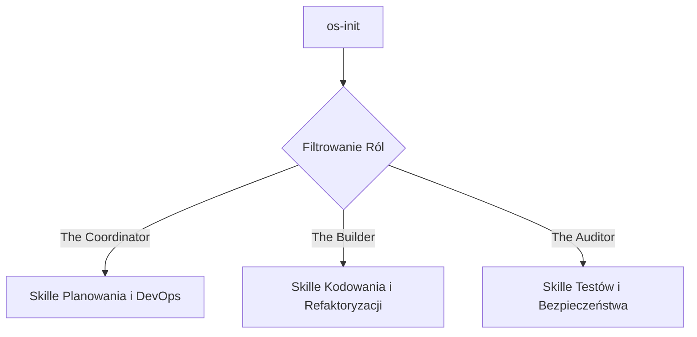

# Analiza i integracja `antigravity-awesome-skills` w systemie AGENTS-OS v4.2

Repozytorium [antigravity-awesome-skills](https://github.com/sickn33/antigravity-awesome-skills) to biblioteka instalacyjna zawierająca ponad 1 400 zoptymalizowanych skilli systemowych (wzorce w plikach `SKILL.md`) kompatybilnych z systemami Claude Code, Gemini CLI, Codex, Cursor i Antigravity.

Oto szczegółowy raport z analizy narzędzia oraz plan jego rozszerzonego wykorzystania w naszym ekosystemie.

---

## 1. Kluczowe funkcje i możliwości narzędzia
* **Automatyczny instalator NPM:** Narzędzie działa jako polecenie `npx antigravity-awesome-skills`, pobierając płytki i wydajny klon repozytorium (release-pinned clone) bez przeciążania dysku pełną historią gita.
* **Filtrowanie i selektywna instalacja:** Obsługuje flagi redukujące ryzyko przeładowania kontekstu modeli (Context Bloat / Split-Brain) poprzez dopasowanie kategorii, tagów oraz poziomu ryzyka:
  * `--category <lista>` (np. `development,backend`)
  * `--risk <poziom>` (np. `safe,none,low,medium,high`)
  * `--tags <lista>`
* **Gotowe zestawy (Bundles) i przepływy (Workflows):** Zapewnia gotowe scenariusze (np. SaaS MVP, audyt bezpieczeństwa, QA & testy) i strukturyzowane sekwencje wywołań w plikach `docs/users/bundles.md` i `docs/users/workflows.md`.
* **Manifest spójności (Stable Manifest):** Dostarcza canonical schemat i indeks skilli w `skills_index.json`, co pozwala agentom odpytywać metadane bez ładowania całych plików playbooków.

---

## 2. Stan obecny w naszym setupie (AGENTS-OS v4.2)
W plikach instalacyjnych naszego systemu mamy już podstawową integrację:
* W pliku [INSTALL.sh](file:///home/tkogut/projects/agents-os-core/INSTALL.sh#L65):
  ```bash
  npx antigravity-awesome-skills --path .agents/skills --risk safe,none
  ```
* W skrypcie bootstrapowym [os-init](file:///home/tkogut/projects/agents-os-core/os-init#L15):
  ```bash
  npx antigravity-awesome-skills --path .agents/skills --risk safe,none
  ```
Instaluje to wyłącznie bezpieczne, nie-destrukcyjne skille bezpośrednio do katalogu `.agents/skills` nowo tworzonych instancji projektowych.

---

## 3. Rekomendacje i plan zaawansowanej integracji

### A. Konfiguracja filtrów bezpieczeństwa i ról (Role-Based Filtering)
Ładowanie wszystkich dostępnych skilli może przekroczyć limit tokenów agenta (Context Overload) lub wprowadzić szum decyzyjny. Powinniśmy spersonalizować instalację w zależności od roli zdefiniowanej w `agents.yaml`:



Zalecamy modyfikację `os-init` lub integrację flag w poleceniu instalatora, aby wspierać selektywne dociąganie skilli:
1. **Dla deweloperów (The Builder):**
   `npx antigravity-awesome-skills --path .agents/skills --category development,coding --risk safe,none,low`
2. **Dla audytorów bezpieczeństwa (The Auditor):**
   `npx antigravity-awesome-skills --path .agents/skills --category security,testing --risk safe,none,low,medium`

### B. Dynamiczne zarządzanie i oczyszczanie (Agent Overload Recovery)
Zaimplementowanie automatycznego oczyszczania osieroconych lub nadmiarowych skilli w `hooks.json`.
Gdy model wchodzi w pętlę przeładowania (crash loop), hook `before_model_call` lub dedykowany skrypt serwisowy powinien przyciąć katalog `.agents/skills/` do absolutnego minimum (zgodnie z instrukcją `docs/users/agent-overload-recovery.md` w awesome-skills).

### C. Lokalne skille i "Custom Skills Override"
Nasz szablon The Vault posiada własne lokalne skille (np. `caveman`, `skill-creator`, `notebooklm-sync`). Narzędzie `npx` nadpisze lub usunie te foldery, jeśli ścieżka nakłada się na repozytorium.
* **Rozwiązanie:** Skonfigurować strukturę tak, aby skille lokalne (tworzone przez dewelopera) leżały w `.agents/skills/local/`, a biblioteka awesome-skills instalowała się bezpośrednio do `.agents/skills/vendor/`, z odpowiednią konfiguracją ścieżki wyszukiwania w systemie (np. aktualizacja specyfikacji RAG w `graph.json`).

### D. Wdrażanie systemowych Workflows
Integracja gotowych workflow (np. `@brainstorming` -> `@test-driven-development` -> `@create-pr`) bezpośrednio do schematu planowania `task.md`. Kiedy orkiestrator generuje nowy plan w `.agents/plans/`, powinien odwoływać się do standardowych identyfikatorów z manifestu `skills_index.json` biblioteki awesome-skills.
