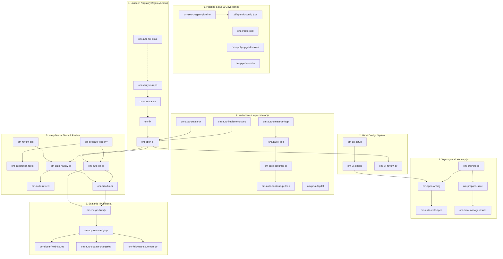

# 🧠 BAZA WIEDZY DLA NOTEBOOK.LM: EKOSYSTEM SKILLI OPEN-MERCATO (OM)
> **Dokument źródłowy:** AGENTS-OS Platform v6.5 Swarm & Cezar Runtime
> **Zastosowanie:** Pełna mapa pojęciowa, relacje encji, architektura przepływów i ontologia dla silnika NotebookLM.
> **Liczba modułów:** 36 autonomicznych umiejętności SDLC.

---

## 🌐 1. MODEL POJĘCIOWY I TOPOLOGIA SYSTEMOWA AGENTS-OS

Ekosystem skilli **Open-Mercato (OM)** to ustrukturyzowana platforma automatyzacji inżynierii oprogramowania (Agentic SDLC). 
Każdy skill reprezentuje wyspecjalizowaną rolę inżynierską działającą według ścisłych kontraktów danych, bramek weryfikacyjnych i zasad izolacji.

### 🏛️ Filary Architektoniczne (Core Concepts):
1. **Pojedyncze Źródło Prawdy (SSOT - `.ai/agentic.config.json`):**
   - Wszystkie skille odczytują konfigurację repozytorium z jednego pliku. Definiuje on skrypty walidacji (lint, test, build), gałąź bazową, ścieżki katalogów (`specs`, `docs`) oraz taksonomię etykiet.
2. **Bezstratny Stan i Odporność na Awarie (Cezar Runtime & `HANDOFF.md`):**
   - Zadania realizowane są w izolowanych środowiskach **Git Worktree**.
   - Postęp, decyzje architektoniczne i stan realizacji są cyklicznie zrzucane do pliku `HANDOFF.md`. W razie awarii agent natychmiast wznawia pracę z punktu kontrolnego.
3. **Zasada Read-Only Triage & Minimal Diff:**
   - Weryfikacja usterek (`om-verify-in-repo`) i diagnoza przyczyn (`om-root-cause`) działają w trybie tylko do odczytu.
   - Implementacja (`om-fix`) dąży do minimalnej niezbędnej zmiany, minimalizując ryzyko regresji.
4. **Wielopoziomowe Bramki Jakości (Quality Gates):**
   - Żaden kod nie trafia do PR ani na gałąź główną bez przejścia bramek: statycznej (linter, typy), dynamicznej (testy jednostkowe, E2E), wizualnej (UX w przeglądarce) oraz audytu bezpieczeństwa.
5. **System Blokad Współbieżności (Claim Locks):**
   - Aby zapobiec konfliktom między równoległymi agentami, zadania w trackerze są rezerwowane (przypisanie + etykieta `in-progress` + komentarz z tokenem sesji).

---

## 🗺️ 2. GRAF PRZEPŁYWÓW I MACIERZ RELACJI MIĘDZY SKILLAMI

Poniższa mapa powiązań definiuje zależności wejścia/wyjścia pomiędzy 36 skillami OM w pełnym cyklu życia oprogramowania:

---

## 📚 3. SZCZEGÓŁOWA ENCYKLOPEDIA 36 SKILLI OM (ENCJE DLA NOTEBOOK.LM)

### 🗂️ 1. Pipeline Core & Konfiguracja Repozytorium

#### 🔹 `om-setup-agent-pipeline` — Konfigurator i Inicjalizator Pipeline'u Agenckiego
- **Identyfikator modułu:** `om-setup-agent-pipeline`
- **Kategoria architektoniczna:** Pipeline Core & Konfiguracja
- **Główny cel i odpowiedzialność:** Inicjalizacja środowiska autonomicznego SDLC w repozytorium poprzez wygenerowanie pojedynczego źródła prawdy (`.ai/agentic.config.json`) oraz dokumentacji bazowej.
- **Kiedy wywoływać (Trigger / Use-Case):** Podczas pierwszego uruchomienia ekosystemu w nowym repozytorium lub gdy zmianie ulega taksonomia etykiet, gałąź bazowa lub skrypty walidacyjne w repozytorium.
- **Kontrakt Wejścia / Wyjścia:**
  - **Wejście (Input):** Analiza plików projektu (package.json, Makefile, pyproject.toml, .github/workflows), ewentualny argument `--defaults`.
  - **Wyjście (Output):** Plik konfiguracyjny `.ai/agentic.config.json`, dokumenty `SDLC.md`, `CODE_REVIEW.md`, `BACKWARD_COMPATIBILITY.md`, starter `AGENTS.md`.
- **Szczegółowy algorytm postępowania (Workflow):**
  1. Inspekcja środowiska: wykrycie narzędzi lintera, testów, formatowania i gałęzi bazowej (main/master).
  2. Sprawdzenie istniejącej konfiguracji: jeśli brak, zadanie pytań konfiguracyjnych (lub użycie `--defaults`).
  3. Wygenerowanie deskryptora `.ai/agentic.config.json` z sekcjami: `paths`, `git`, `validation`, `labels`, `tracker`.
  4. Utworzenie brakujących dokumentów projektowych definiujących zasady inżynieryjne dla agentów.
  5. Weryfikacja pokrycia: sprawdzenie dostępności pozostałych skilli OM i wygenerowanie komend instalacyjnych w razie braków.
- **Wymagane narzędzia i uprawnienia:** Zapis/odczyt plików konfiguracyjnych, operacje Git do wykrycia gałęzi bazowej.
- **Relacje w grafie węzłów (Cross-Skill Chaining):**
  - *Węzły nadrzędne / Wymagania wstępne:* Brak (jest korzeniem całego ekosystemu).
  - *Węzły docelowe / Następniki:* Wszystkie pozostałe skille OM (każdy skill czyta konfigurację z tego pliku).
- **Odporność na awarie i zachowanie w błędach (Fault Tolerance):** Brak wykrytych poleceń walidacyjnych → fallback do bezpiecznych wartości domyślnych lub wymuszenie interaktywnego podania komend.

#### 🔹 `om-pipeline-retro` — Analityka Wydajności i Retrospektywa Pipeline'u
- **Identyfikator modułu:** `om-pipeline-retro`
- **Kategoria architektoniczna:** Pipeline Core & Analityka
- **Główny cel i odpowiedzialność:** Audyt i klasyfikacja historycznych przebiegów pipeline'u agentowego pod kątem czasu trwania, awaryjności i kosztu poprawek.
- **Kiedy wywoływać (Trigger / Use-Case):** Gdy zespół zauważa spadek produktywności agentów, dużą liczbę ponownych przebiegów (re-runs) lub chce zoptymalizować czas wykonania zadań.
- **Kontrakt Wejścia / Wyjścia:**
  - **Wejście (Input):** Historia zgłoszeń, PR-ów i logów w trackerze zadań.
  - **Wyjście (Output):** Raport retrospektywny z rankingiem przyczyn opóźnień oraz przekazanie danych do `om-prepare-issue` w celu usunięcia wąskich gardeł.
- **Szczegółowy algorytm postępowania (Workflow):**
  1. Odczyt zdarzeń z trackera dotyczących ukończonych zadań.
  2. Klasyfikacja przebiegów na kategorie: Clean Single Pass (sukces za 1 razem), Hard Recovery (awaryjne wznowienie), Loop Checkpoints (wieloetapowe pętle), Cause Not Recorded.
  3. Obliczenie kosztu w roboczogodzinach (wall-clock hours) utraconych na poprawki.
  4. Wyłonienie głównej przyczyny strat i sformułowanie rekomendacji naprawczej.
- **Wymagane narzędzia i uprawnienia:** Tryb TYLKO DO ODCZYTU (Read-Only) w trackerze i repozytorium.
- **Relacje w grafie węzłów (Cross-Skill Chaining):**
  - *Węzły nadrzędne / Wymagania wstępne:* Zarejestrowane przebiegi w trackerze.
  - *Węzły docelowe / Następniki:* `om-prepare-issue` (do utworzenia zadań optymalizacyjnych).
- **Odporność na awarie i zachowanie w błędach (Fault Tolerance):** Brak wystarczającej liczby danych historycznych → raport informacyjny o braku próby statystycznej.

#### 🔹 `om-create-skill` — Architekt i Kreator Nowych Skilli OM
- **Identyfikator modułu:** `om-create-skill`
- **Kategoria architektoniczna:** Pipeline Core & Rozbudowa
- **Główny cel i odpowiedzialność:** Autorskie tworzenie nowych skilli OM lub bezpieczny podział przerośniętych plików `SKILL.md` na modułowe warstwy `references/`.
- **Kiedy wywoływać (Trigger / Use-Case):** Podczas dodawania nowej specjalizacji do ekosystemu lub refaktoryzacji istniejącej wiedzy agenta.
- **Kontrakt Wejścia / Wyjścia:**
  - **Wejście (Input):** Brief opisujący przeznaczenie nowego skilla lub ścieżka do istniejącego pliku `SKILL.md`.
  - **Wyjście (Output):** Katalog nowego skilla z plikiem `SKILL.md`, podkatalogiem `references/` i walidacją lintera.
- **Szczegółowy algorytm postępowania (Workflow):**
  1. Analiza wymagań pod kątem filozofii warstwowej (Layering Philosophy).
  2. Wygenerowanie metadanych YAML frontmatter (nazwa, opis, uprawnienia).
  3. Ekstrakcja szczegółowej wiedzy do plików w katalogu `references/` (zapobieganie bloatowi kontekstowemu).
  4. Uruchomienie bramki weryfikacyjnej lintera sprawdzającej niezmienniki jakościowe.
  5. Zarejestrowanie skilla w rejestrze systemowym.
- **Wymagane narzędzia i uprawnienia:** Zapis i tworzenie katalogów/plików, uruchamianie wewnętrznych skryptów walidacji lintera.
- **Relacje w grafie węzłów (Cross-Skill Chaining):**
  - *Węzły nadrzędne / Wymagania wstępne:* `om-setup-agent-pipeline`.
  - *Węzły docelowe / Następniki:* `om-apply-upgrade-notes`.
- **Odporność na awarie i zachowanie w błędach (Fault Tolerance):** Naruszenie reguł lintera skilli → zablokowanie zapisu i wymuszenie korekty strukturalnej.

#### 🔹 `om-apply-upgrade-notes` — Migrator Wersji i Reguł Skilli
- **Identyfikator modułu:** `om-apply-upgrade-notes`
- **Kategoria architektoniczna:** Pipeline Core & Utrzymanie
- **Główny cel i odpowiedzialność:** Automatyczne wdrażanie instrukcji aktualizacyjnych zawartych w `UPGRADE_NOTES.md` po podbiciu wersji biblioteki skilli.
- **Kiedy wywoływać (Trigger / Use-Case):** Bezpośrednio po aktualizacji repozytorium skilli OM lub po pobraniu zmian z nadrzędnego repozytorium.
- **Kontrakt Wejścia / Wyjścia:**
  - **Wejście (Input):** Plik `UPGRADE_NOTES.md` w korzeniu skilli.
  - **Wyjście (Output):** Zaktualizowane pliki konfiguracyjne i zmigrowany kod reguł.
- **Szczegółowy algorytm postępowania (Workflow):**
  1. Parsowanie wpisów migracyjnych w `UPGRADE_NOTES.md`.
  2. Wykrycie wersji obecnej w repozytorium i wyznaczenie brakujących kroków migracji.
  3. Zastosowanie modyfikacji w konfiguracji `.ai/agentic.config.json` oraz szablonach.
  4. Walidacja poprawności po aktualizacji.
- **Wymagane narzędzia i uprawnienia:** Modyfikacja plików konfiguracyjnych i dokumentacji.
- **Relacje w grafie węzłów (Cross-Skill Chaining):**
  - *Węzły nadrzędne / Wymagania wstępne:* Aktualizacja kodu skilli.
  - *Węzły docelowe / Następniki:* `om-setup-agent-pipeline`.
- **Odporność na awarie i zachowanie w błędach (Fault Tolerance):** Konflikt wersji → utworzenie raportu rozbieżności dla dewelopera.

### 🗂️ 2. Inżynieria Wymagań, Specyfikacje & Zarządzanie Zadaniami (Issues)

#### 🔹 `om-brainstorm` — Dywergentna Burza Mózgów i Walidacja Koncepcji
- **Identyfikator modułu:** `om-brainstorm`
- **Kategoria architektoniczna:** Inżynieria Wymagań & Koncepcja
- **Główny cel i odpowiedzialność:** Ustrukturyzowana dyskusja przed rozpoczęciem prac nad kodem lub specyfikacją w celu zbadania alternatyw i wyznaczenia optymalnego podejścia.
- **Kiedy wywoływać (Trigger / Use-Case):** Gdy użytkownik rzuca luźny pomysł ('czy warto to robić?', 'przemyślmy architekturę', 'mam koncepcję').
- **Kontrakt Wejścia / Wyjścia:**
  - **Wejście (Input):** Luźny opis pomysłu, problemu biznesowego lub technicznego.
  - **Wyjście (Output):** Zwięzły brief decyzyjny (Handoff Brief) przekazywany do `om-spec-writing` lub `om-prepare-issue`.
- **Szczegółowy algorytm postępowania (Workflow):**
  1. Zadawanie pytań otwartych — ściśle po jednym na raz, aby nie przeciążać użytkownika.
  2. Analiza alternatyw technologicznych, w tym wariantu zaniechania budowy ('build nothing').
  3. Konwergencja dyskusji do konkretnej decyzji architektonicznej.
  4. Sformułowanie ustrukturyzowanego podsumowania dla kolejnych faz SDLC.
- **Wymagane narzędzia i uprawnienia:** Interaktywny dialog, czytanie istniejącej dokumentacji.
- **Relacje w grafie węzłów (Cross-Skill Chaining):**
  - *Węzły nadrzędne / Wymagania wstępne:* Inicjatywa użytkownika / pomysł biznesowy.
  - *Węzły docelowe / Następniki:* `om-spec-writing`, `om-prepare-issue`, `om-ux-shape`.
- **Odporność na awarie i zachowanie w błędach (Fault Tolerance):** Brak jednoznacznej decyzji użytkownika → zatrzymanie i prośba o sprecyzowanie kryteriów wyboru.

#### 🔹 `om-spec-writing` — Opracowywanie Specyfikacji Technicznych Staff Engineer
- **Identyfikator modułu:** `om-spec-writing`
- **Kategoria architektoniczna:** Inżynieria Wymagań & Specyfikacje
- **Główny cel i odpowiedzialność:** Projektowanie i weryfikacja technicznych specyfikacji architektonicznych (RFC / Design Doc) zgodnie z najwyższymi standardami inżynierii oprogramowania.
- **Kiedy wywoływać (Trigger / Use-Case):** Przed rozpoczęciem prac nad nową, złożoną funkcjonalnością wymagającą podziału na fazy i interfejsy.
- **Kontrakt Wejścia / Wyjścia:**
  - **Wejście (Input):** Brief koncepcyjny, istniejące wzorce w repozytorium.
  - **Wyjście (Output):** Plik specyfikacji `.ai/specs/{YYYY-MM-DD}-{title}.md` z planem wdrożenia krok po kroku.
- **Szczegółowy algorytm postępowania (Workflow):**
  1. Tryb Skeleton-First: najpierw powstaje szkielet (TLDR + 2-3 kluczowe sekcje) z sekcją pytań otwartych (Open Questions Gate).
  2. W trybie interaktywnym: twarde zatrzymanie do czasu uzyskania odpowiedzi użytkownika; w trybie `--autonomous`: przyjęcie bezpiecznych założeń domyślnych.
  3. Badanie rynku i wzorców wiodących projektów opensource/enterprise.
  4. Dekompozycja wdrożenia na autonomiczne fazy i kroki (Implementation Breakdown) gotowe do przetworzenia przez automaty.
  5. Rygorystyczny przegląd architektoniczny z hierarchią wag uwag.
- **Wymagane narzędzia i uprawnienia:** Zapis w katalogu specyfikacji (`paths.specs`), czytanie całego repozytorium.
- **Relacje w grafie węzłów (Cross-Skill Chaining):**
  - *Węzły nadrzędne / Wymagania wstępne:* `om-brainstorm`.
  - *Węzły docelowe / Następniki:* `om-auto-implement-spec`, `om-auto-write-spec`.
- **Odporność na awarie i zachowanie w błędach (Fault Tolerance):** Nierozwiązane pytania blokujące architekturę → zatrzymanie generowania i zgłoszenie wątpliwości.

#### 🔹 `om-auto-write-spec` — Autonomiczny Generator Specyfikacji i PR
- **Identyfikator modułu:** `om-auto-write-spec`
- **Kategoria architektoniczna:** Inżynieria Wymagań & Automatyzacja
- **Główny cel i odpowiedzialność:** Bezobsługowa zamiana zgłoszenia z trackera lub briefu w gotową specyfikację wystawioną w formie Pull Requesta.
- **Kiedy wywoływać (Trigger / Use-Case):** Gdy chcemy błyskawicznie zamienić feature request w sformalizowany PR ze specyfikacją bez ręcznego pisania.
- **Kontrakt Wejścia / Wyjścia:**
  - **Wejście (Input):** Numer issue lub krótki brief funkcjonalny.
  - **Wyjście (Output):** Otwarty PR zawierający plik `.ai/specs/...`, zrzuty ekranu makiety (jeśli dostępna przeglądarka) i etykiety SDLC.
- **Szczegółowy algorytm postępowania (Workflow):**
  1. Uruchomienie `om-spec-writing` z flagą `--autonomous`.
  2. Automatyczne rozstrzygnięcie pytań otwartych z adnotacją o możliwości ich nadpisania przez człowieka.
  3. Przygotowanie wizualnych makiet lub zrzutów stanu obecnego jako dowodu w PR.
  4. Utworzenie gałęzi `spec/...`, commit i wystawienie PR przez `om-open-pr`.
  5. Wygenerowanie znaczników ułatwiających natychmiastowe uruchomienie `om-auto-implement-spec`.
- **Wymagane narzędzia i uprawnienia:** Tworzenie gałęzi Git, zapis specyfikacji, operacje w trackerze PR.
- **Relacje w grafie węzłów (Cross-Skill Chaining):**
  - *Węzły nadrzędne / Wymagania wstępne:* Issue w trackerze lub brief.
  - *Węzły docelowe / Następniki:* `om-auto-implement-spec`.
- **Odporność na awarie i zachowanie w błędach (Fault Tolerance):** Brak możliwości jednoznacznego zinterpretowania wymagań → zgłoszenie komentarza w issue z prośbą o doprecyzowanie.

#### 🔹 `om-prepare-issue` — Generator Precyzyjnych Zgłoszeń (Issue Author)
- **Identyfikator modułu:** `om-prepare-issue`
- **Kategoria architektoniczna:** Zarządzanie Zadaniami & Triaż
- **Główny cel i odpowiedzialność:** Utworzenie profesjonalnego, kompletnego zgłoszenia w trackerze zadań (GitHub Issues) bez natychmiastowej implementacji.
- **Kiedy wywoływać (Trigger / Use-Case):** Gdy pojawia się pomysł lub raport błędu, który chcemy zaparkować w backlogu z pełnym kontekstem technicznym.
- **Kontrakt Wejścia / Wyjścia:**
  - **Wejście (Input):** Opis problemu/funkcji, ewentualne załączniki graficzne.
  - **Wyjście (Output):** Utworzone zgłoszenie w trackerze z etykietami SDLC i powiązaną specyfikacją.
- **Szczegółowy algorytm postępowania (Workflow):**
  1. Deduplikacja: przeszukanie istniejących zgłoszeń i PR pod kątem podobnych tematów.
  2. Weryfikacja powiązania ze specyfikacją: podlinkowanie istniejącej lub przygotowanie szkieletu.
  3. Dołączenie dowodów wizualnych (zrzuty ekranu, logi błędów).
  4. Zbudowanie ustrukturyzowanej treści: opis, kroki odtworzenia / założenia, kryteria akceptacji (Checklist).
  5. Nadanie odpowiednich etykiet taksonomicznych.
- **Wymagane narzędzia i uprawnienia:** Dostęp do API trackera (tworzenie issues, wyszukiwanie).
- **Relacje w grafie węzłów (Cross-Skill Chaining):**
  - *Węzły nadrzędne / Wymagania wstępne:* `om-brainstorm`, `om-pipeline-retro`.
  - *Węzły docelowe / Następniki:* `om-auto-fix-issue`, `om-auto-implement-spec`.
- **Odporność na awarie i zachowanie w błędach (Fault Tolerance):** Wykrycie istniejącego duplikatu → zwrócenie linku do istniejącego issue zamiast tworzenia nowego.

#### 🔹 `om-auto-manage-issues` — Higienista i Standaryzator Tablicy Zgłoszeń
- **Identyfikator modułu:** `om-auto-manage-issues`
- **Kategoria architektoniczna:** Zarządzanie Zadaniami & Triaż
- **Główny cel i odpowiedzialność:** Masowy audyt i doprowadzenie istniejących zgłoszeń w trackerze do formalnego standardu SDLC.
- **Kiedy wywoływać (Trigger / Use-Case):** Podczas porządkowania backlogu, gdy wiele issues nie posiada etykiet, kryteriów akceptacji lub linków do kodu.
- **Kontrakt Wejścia / Wyjścia:**
  - **Wejście (Input):** Lista otwartych zgłoszeń w trackerze.
  - **Wyjście (Output):** Zaktualizowane opisy zgłoszeń, uzupełnione metadane i etykiety.
- **Szczegółowy algorytm postępowania (Workflow):**
  1. Pobranie nieuporządkowanych zgłoszeń.
  2. Analiza treści każdego zgłoszenia pod kątem kompletności technicznej.
  3. Dodanie brakujących sekcji (Scope, Acceptance Criteria, Reproducibility).
  4. Przypisanie etykiet priorytetu i modułu.
- **Wymagane narzędzia i uprawnienia:** Modyfikacja metadanych i komentarzy w trackerze zgłoszeń.
- **Relacje w grafie węzłów (Cross-Skill Chaining):**
  - *Węzły nadrzędne / Wymagania wstępne:* `om-prepare-issue`.
  - *Węzły docelowe / Następniki:* `om-auto-fix-issue`.
- **Odporność na awarie i zachowanie w błędach (Fault Tolerance):** Zgłoszenie nieczytelne / puste → oznaczenie etykietą `needs-info` i dodanie komentarza.

#### 🔹 `om-followup-issue-from-pr` — Ekstraktor Zadań Odroczonych z PR
- **Identyfikator modułu:** `om-followup-issue-from-pr`
- **Kategoria architektoniczna:** Zarządzanie Zadaniami & Follow-up
- **Główny cel i odpowiedzialność:** Przekształcenie dyskusji, uwag z code review lub odłożonych wątków w PR w formalne zgłoszenia w trackerze.
- **Kiedy wywoływać (Trigger / Use-Case):** Gdy podczas review PR pojawia się cenna uwaga wykraczająca poza bieżący scope, którą należy zrealizować w kolejnym kroku.
- **Kontrakt Wejścia / Wyjścia:**
  - **Wejście (Input):** Link do PR lub identyfikator konkretnego komentarza recenzenta.
  - **Wyjście (Output):** Nowe issue w trackerze przypisane do autora PR lub recenzenta z linkiem zwrotnym.
- **Szczegółowy algorytm postępowania (Workflow):**
  1. Pobranie kontekstu ze wskazanego komentarza w PR.
  2. Wyodrębnienie konkretnego zadania do wykonania (Actionable Ask).
  3. Otwarcie issue ze specjalnym prefiksem (np. `Followup:` lub `Implement:`) i przypisanie do odpowiedniej osoby.
  4. Wstawienie komentarza w wątku PR potwierdzającego odroczenie zadania.
- **Wymagane narzędzia i uprawnienia:** Odczyt PR i komentarzy, tworzenie nowych zgłoszeń w trackerze.
- **Relacje w grafie węzłów (Cross-Skill Chaining):**
  - *Węzły nadrzędne / Wymagania wstępne:* `om-code-review`, `om-auto-review-pr`.
  - *Węzły docelowe / Następniki:* `om-prepare-issue`, `om-auto-fix-issue`.
- **Odporność na awarie i zachowanie w błędach (Fault Tolerance):** Brak jednoznacznego zadania w komentarzu → prośba o sprecyzowanie zakresu.

#### 🔹 `om-close-fixed-issues` — Automat Zamykający Rozwiązane Zgłoszenia
- **Identyfikator modułu:** `om-close-fixed-issues`
- **Kategoria architektoniczna:** Zarządzanie Zadaniami & Release
- **Główny cel i odpowiedzialność:** Precyzyjne zamykanie zgłoszeń autorytatywnie naprawionych przez niedawno scalone PR-y.
- **Kiedy wywoływać (Trigger / Use-Case):** Jako element procedury po scaleniu (Post-Merge Housekeeping) oraz przed wydaniem nowej wersji.
- **Kontrakt Wejścia / Wyjścia:**
  - **Wejście (Input):** Historia niedawno zmergowanych PR-ów i referencje zamykające (`fixes #123`, `closingIssuesReferences`).
  - **Wyjście (Output):** Zamknięte issues z informacyjnym komentarzem podsumowującym wdrożenie.
- **Szczegółowy algorytm postępowania (Workflow):**
  1. Skanowanie zmergowanych PR-ów pod kątem słów kluczowych powiązania z issues.
  2. Weryfikacja, czy PR trafił do gałęzi bazowej (main/master).
  3. Bezpieczne zamykanie powiązanych zgłoszeń z ignorowaniem luźnych wzmianek (bare mentions `#N`).
  4. Zdejmowanie blokad zadania (Claim Locks) i publikacja notki zamykającej.
- **Wymagane narzędzia i uprawnienia:** Zamykanie issues, dodawanie komentarzy w trackerze.
- **Relacje w grafie węzłów (Cross-Skill Chaining):**
  - *Węzły nadrzędne / Wymagania wstępne:* `om-approve-merge-pr`.
  - *Węzły docelowe / Następniki:* `om-auto-update-changelog`.
- **Odporność na awarie i zachowanie w błędach (Fault Tolerance):** PR zamknięty bez scalenia → wstawienie jedynie komentarza informacyjnego bez zamykania problemu bazowego.

### 🗂️ 3. UX, Design System & Badanie Interfejsów

#### 🔹 `om-ux-setup` — Ekstraktor Kontraktu Design Systemu
- **Identyfikator modułu:** `om-ux-setup`
- **Kategoria architektoniczna:** UX & Design System
- **Główny cel i odpowiedzialność:** Wyodrębnienie specyficznego dla danego repozytorium kontraktu wizualnego (tokeny, komponenty, archetypy) do katalogu `.uxproof/`.
- **Kiedy wywoływać (Trigger / Use-Case):** Jednorazowo podczas konfiguracji UI w projekcie lub po gruntownej zmianie biblioteki stylów / design systemu.
- **Kontrakt Wejścia / Wyjścia:**
  - **Wejście (Input):** Drzewo kodu aplikacji (pliki CSS, Tailwind, komponenty React/Vue/Svelte).
  - **Wyjście (Output):** Katalog `.uxproof/` zawierający pliki kontraktu wzorniczego oraz raport podsumowujący.
- **Szczegółowy algorytm postępowania (Workflow):**
  1. Inspekcja kodu pod kątem palety kolorów, typografii, odstępów i tokenów.
  2. Rejestracja bazowych komponentów UI (Button, Input, Modal, itp.).
  3. Zdefiniowanie archetypów ekranów obecnych w aplikacji.
  4. Zapis maszynowego kontraktu wzorniczego, który będzie stanowił bazę ocen dla skilli review.
- **Wymagane narzędzia i uprawnienia:** Skanowanie kodu frontendowego, zapis plików w `.uxproof/`.
- **Relacje w grafie węzłów (Cross-Skill Chaining):**
  - *Węzły nadrzędne / Wymagania wstępne:* `om-setup-agent-pipeline`.
  - *Węzły docelowe / Następniki:* `om-ux-shape`, `om-ux-review-pr`.
- **Odporność na awarie i zachowanie w błędach (Fault Tolerance):** Brak zdefiniowanego design systemu w kodzie → propozycja de facto palety na podstawie najczęściej używanych klas/kolorów.

#### 🔹 `om-ux-shape` — Kształtowanie Cech Produktu i Interfejsu (UX Shaping)
- **Identyfikator modułu:** `om-ux-shape`
- **Kategoria architektoniczna:** UX & Design System
- **Główny cel i odpowiedzialność:** Przekształcenie mglistej idei funkcji UI lub interakcji AI w jednoznaczną, przetestowaną koncepcyjnie decyzję produktową.
- **Kiedy wywoływać (Trigger / Use-Case):** Przed projektowaniem ekranów, przy upraszczaniu skomplikowanych przepływów lub określaniu zachowań komponentów AI.
- **Kontrakt Wejścia / Wyjścia:**
  - **Wejście (Input):** Koncepcja funkcji lub obecny skomplikowany ekran/flow.
  - **Wyjście (Output):** Wypełniony dokument Shape z kryteriami użyteczności, stanami ekranów i ograniczeniami.
- **Szczegółowy algorytm postępowania (Workflow):**
  1. Wybór trybu: `Shape` (dla nowych funkcji) lub `Review` (dla upraszczania istniejących obszarów).
  2. Zdefiniowanie wartości użytkownika, wartości biznesowej i ograniczeń wykonawczych.
  3. Modelowanie zachowania AI (determinizm, latencja, obsługa błędów modelu).
  4. Określenie stanów ekranów: stan początkowy, ładowanie, pusty, błąd, sukces.
  5. Przygotowanie wytycznych handoffu dla inżynierów.
- **Wymagane narzędzia i uprawnienia:** Czytanie kontraktu `.uxproof/`, analiza kodu interfejsu.
- **Relacje w grafie węzłów (Cross-Skill Chaining):**
  - *Węzły nadrzędne / Wymagania wstępne:* `om-ux-setup`, `om-brainstorm`.
  - *Węzły docelowe / Następniki:* `om-spec-writing`, `om-auto-implement-spec`.
- **Odporność na awarie i zachowanie w błędach (Fault Tolerance):** Zbyt skomplikowany przepływ → wymuszenie dekompozycji na mniejsze jednostki interakcji.

#### 🔹 `om-ux-review-pr` — Audyt Wizualny i Ergonomii UI w Pull Requeście
- **Identyfikator modułu:** `om-ux-review-pr`
- **Kategoria architektoniczna:** UX & Design System
- **Główny cel i odpowiedzialność:** Ekspercka ocena zmian interfejsu w PR oparta na dowodach wizualnych z perspektywy Senior Product Designera.
- **Kiedy wywoływać (Trigger / Use-Case):** Dla każdego PR-a wprowadzającego lub modyfikującego widoki, style i interakcje użytkownika.
- **Kontrakt Wejścia / Wyjścia:**
  - **Wejście (Input):** Środowisko podglądu PR i sterownik przeglądarki.
  - **Wyjście (Output):** Ustrukturyzowany raport UX zawierający: Dowód, Wzorzec, Kompromis i Kryterium Akceptacji.
- **Szczegółowy algorytm postępowania (Workflow):**
  1. Uruchomienie aplikacji na branchu PR z użyciem dostawcy przeglądarki.
  2. Przejście kluczowych ścieżek użytkownika (User Journey) i wykonanie zadań.
  3. Rejestracja zrzutów ekranu w momentach anomalii wizualnych lub problemów z responsywnością.
  4. Sformułowanie 4-częściowych uwag rankingowanych według wpływu na użytkownika.
  5. Opublikowanie raportu w dyskusji PR.
- **Wymagane narzędzia i uprawnienia:** Sterowanie przeglądarką (Browser provider), zrzuty ekranu, komentowanie PR.
- **Relacje w grafie węzłów (Cross-Skill Chaining):**
  - *Węzły nadrzędne / Wymagania wstępne:* `om-prepare-test-env`, `om-open-pr`.
  - *Węzły docelowe / Następniki:* `om-auto-fix-pr`, `om-approve-merge-pr`.
- **Odporność na awarie i zachowanie w błędach (Fault Tolerance):** Brak możliwości uruchomienia aplikacji w przeglądarce → degradacja do statycznej analizy komponentów z ostrzeżeniem.

### 🗂️ 4. Autonomiczna Implementacja, Naprawa Błędów & Pętle Zadań

#### 🔹 `om-verify-in-repo` — Bezzapisowa Brama Triażu Błędów (Triage Gate)
- **Identyfikator modułu:** `om-verify-in-repo`
- **Kategoria architektoniczna:** Autonomiczna Implementacja & Bugfix
- **Główny cel i odpowiedzialność:** Błyskawiczne i bezpieczne (Read-Only) sprawdzenie, czy zgłoszony błąd rzeczywiście występuje na bieżącej gałęzi.
- **Kiedy wywoływać (Trigger / Use-Case):** Krok 1 każdego zautomatyzowanego łańcucha naprawy błędu (Autofix Chain).
- **Kontrakt Wejścia / Wyjścia:**
  - **Wejście (Input):** Identyfikator zgłoszenia `{issueId}`.
  - **Wyjście (Output):** Decyzja binarna: `PROCEED` (kontynuuj naprawę) lub `NO_ACTION_NEEDED` (zatrzymaj łańcuch).
- **Szczegółowy algorytm postępowania (Workflow):**
  1. Odczyt treści zgłoszenia z trackera.
  2. Sprawdzenie, czy błąd nie został już naprawiony na obecnym branchu.
  3. Sprawdzenie, czy inne zadanie/agent nie prowadzi już prac nad tym problemem.
  4. Przeszukanie otwartych PR-ów pod kątem istniejących poprawek.
  5. Podjęcie decyzji: wstrzymanie łańcucha, jeśli błąd nie istnieje, lub autoryzacja kolejnego kroku.
- **Wymagane narzędzia i uprawnienia:** ŚCIŚLE READ-ONLY: brak możliwości edycji plików, wyłącznie czytanie kodu i operacje Git read.
- **Relacje w grafie węzłów (Cross-Skill Chaining):**
  - *Węzły nadrzędne / Wymagania wstępne:* Zgłoszenie błędu w trackerze.
  - *Węzły docelowe / Następniki:* `om-root-cause`.
- **Odporność na awarie i zachowanie w błędach (Fault Tolerance):** Problem już rozwiązany lub brak dowodów na usterkę → natychmiastowe zakończenie z kodem `NO_ACTION_NEEDED`.

#### 🔹 `om-root-cause` — Analityk Przyczyn Źródłowych (RCA Engine)
- **Identyfikator modułu:** `om-root-cause`
- **Kategoria architektoniczna:** Autonomiczna Implementacja & Bugfix
- **Główny cel i odpowiedzialność:** Lokalizacja sedna usterki w kodzie i wyznaczenie minimalnej powierzchni niezbędnych zmian przed przystąpieniem do kodowania.
- **Kiedy wywoływać (Trigger / Use-Case):** Krok 2 łańcucha naprawczego po pozytywnej weryfikacji błędu przez `om-verify-in-repo`.
- **Kontrakt Wejścia / Wyjścia:**
  - **Wejście (Input):** Kontekst zweryfikowanego błędu z kroku 1.
  - **Wyjście (Output):** Krótkie podsumowanie RCA, lista plików do modyfikacji oraz proponowany szkic rozwiązania.
- **Szczegółowy algorytm postępowania (Workflow):**
  1. Analiza stosu błędów (stack traces), logów i ścieżek wykonania.
  2. Wskazanie konkretnych linii kodu i plików odpowiedzialnych za usterkę.
  3. Opracowanie strategii minimalnej ingerencji w kod (minimal diff principle).
  4. Zapisanie wyników analizy dla skilla implementacyjnego.
- **Wymagane narzędzia i uprawnienia:** Tryb READ-ONLY: eksploracja repozytorium bez prawa zapisu.
- **Relacje w grafie węzłów (Cross-Skill Chaining):**
  - *Węzły nadrzędne / Wymagania wstępne:* `om-verify-in-repo`.
  - *Węzły docelowe / Następniki:* `om-fix`.
- **Odporność na awarie i zachowanie w błędach (Fault Tolerance):** Niejednoznaczne źródło błędu → wskazanie 2-3 najbardziej prawdopodobnych hipotez z planem ich weryfikacji.

#### 🔹 `om-fix` — Chirurgiczna Implementacja Poprawki Błędu
- **Identyfikator modułu:** `om-fix`
- **Kategoria architektoniczna:** Autonomiczna Implementacja & Bugfix
- **Główny cel i odpowiedzialność:** Wdrożenie minimalnej zmiany w kodzie usuwającej usterkę, dodanie testów regresyjnych i uruchomienie walidacji.
- **Kiedy wywoływać (Trigger / Use-Case):** Krok 3 łańcucha naprawczego posiadający gotową analizę z `om-root-cause`.
- **Kontrakt Wejścia / Wyjścia:**
  - **Wejście (Input):** Wyznaczone pliki i strategia z kroku RCA.
  - **Wyjście (Output):** Zmodyfikowany kod w worktree, nowe testy regresyjne, pomyślny wynik walidacji lintera/testów.
- **Szczegółowy algorytm postępowania (Workflow):**
  1. Zablokowanie zadania w trackerze (Claim Lock: assignee + etykieta `in-progress` + komentarz).
  2. Edycja wskazanych plików z zachowaniem minimalnego diffa.
  3. Dodanie testu regresyjnego potwierdzającego usunięcie defektu.
  4. Uruchomienie pełnego zestawu walidacji z `.ai/agentic.config.json`.
  5. Pozostawienie zmian w worktree (nie tworzy commita ani PR – to zadanie `om-open-pr`).
- **Wymagane narzędzia i uprawnienia:** Zapis i edycja plików kodu, uruchamianie poleceń testowych w shellu.
- **Relacje w grafie węzłów (Cross-Skill Chaining):**
  - *Węzły nadrzędne / Wymagania wstępne:* `om-root-cause`.
  - *Węzły docelowe / Następniki:* `om-open-pr`.
- **Odporność na awarie i zachowanie w błędach (Fault Tolerance):** Błąd walidacji testów → iteracyjna samonaprawa kodu aż do uzyskania zielonego statusu.

#### 🔹 `om-auto-fix-issue` — End-to-End Orkiestrator Naprawy Zgłoszeń
- **Identyfikator modułu:** `om-auto-fix-issue`
- **Kategoria architektoniczna:** Autonomiczna Implementacja & Orkiestracja
- **Główny cel i odpowiedzialność:** Kompletna, bezobsługowa naprawa zgłoszenia błędu od podania numeru issue aż po wystawienie zrecenzowanego PR.
- **Kiedy wywoływać (Trigger / Use-Case):** Jako pojedyncza komenda naprawcza dla zdefiniowanego issue (np. `om-auto-fix-issue 42`).
- **Kontrakt Wejścia / Wyjścia:**
  - **Wejście (Input):** Numer issue `{issueId}`.
  - **Wyjście (Output):** Gotowy, przetestowany i zrecenzowany Pull Request rozwiązujący zgłoszenie.
- **Szczegółowy algorytm postępowania (Workflow):**
  1. Wywołanie `om-verify-in-repo` (weryfikacja istnienia błędu).
  2. Wywołanie `om-root-cause` (diagnoza źródła).
  3. Wywołanie `om-fix` (kodowanie i testy).
  4. Wywołanie `om-open-pr` (wypchnięcie gałęzi i otwarcie PR).
  5. Wywołanie `om-auto-review-pr` (końcowy audyt jakościowy PR).
- **Wymagane narzędzia i uprawnienia:** Pełne uprawnienia orkiestratora (odczyt, zapis, git, shell, tracker).
- **Relacje w grafie węzłów (Cross-Skill Chaining):**
  - *Węzły nadrzędne / Wymagania wstępne:* Zgłoszenie w trackerze.
  - *Węzły docelowe / Następniki:* `om-approve-merge-pr`.
- **Odporność na awarie i zachowanie w błędach (Fault Tolerance):** Przerwanie na dowolnym etapie bramki → bezpieczne zwolnienie blokady zadania i zaraportowanie przyczyny.

#### 🔹 `om-auto-implement-spec` — Autonomiczny Wdrażacz Pełnych Specyfikacji
- **Identyfikator modułu:** `om-auto-implement-spec`
- **Kategoria architektoniczna:** Autonomiczna Implementacja & Orkiestracja
- **Główny cel i odpowiedzialność:** Wdrożenie kompletnej specyfikacji technicznej faza po fazie z zachowaniem testów i wystawieniem zweryfikowanego PR.
- **Kiedy wywoływać (Trigger / Use-Case):** Gdy istnieje gotowy plik specyfikacji `.ai/specs/...` i chcemy przekształcić go w działające oprogramowanie.
- **Kontrakt Wejścia / Wyjścia:**
  - **Wejście (Input):** Ścieżka do pliku specyfikacji lub powiązane issue.
  - **Wyjście (Output):** Gotowy Pull Request z pełnym kodem, testami i dokumentacją.
- **Szczegółowy algorytm postępowania (Workflow):**
  1. Parsowanie faz i kroków wdrożeniowych ze specyfikacji.
  2. Utworzenie dedykowanego środowiska Git Worktree.
  3. Sekwencyjna implementacja każdego kroku z uruchamianiem testów jednostkowych.
  4. Zrzucanie postępów do `HANDOFF.md` po każdej ukończonej jednostce.
  5. Wystawienie PR i delegacja do audytu jakościowego.
- **Wymagane narzędzia i uprawnienia:** Pełny dostęp do edycji kodu, kompilacji, uruchamiania testów i Git.
- **Relacje w grafie węzłów (Cross-Skill Chaining):**
  - *Węzły nadrzędne / Wymagania wstępne:* `om-spec-writing`, `om-auto-write-spec`.
  - *Węzły docelowe / Następniki:* `om-auto-qa-pr`, `om-auto-review-pr`.
- **Odporność na awarie i zachowanie w błędach (Fault Tolerance):** Napotkanie błędu logicznego w specyfikacji → wygenerowanie punktu kontrolnego i prośba o decyzję inżynierską.

#### 🔹 `om-auto-create-pr` — Uniwersalny Realizator Zadań Autonomicznych
- **Identyfikator modułu:** `om-auto-create-pr`
- **Kategoria architektoniczna:** Autonomiczna Implementacja & Zadania
- **Główny cel i odpowiedzialność:** Wykonanie dowolnego zadania programistycznego na podstawie polecenia i dostarczenie go jako gotowego PR.
- **Kiedy wywoływać (Trigger / Use-Case):** Do zadań średniej wielkości, refaktoryzacji lub dodawania mniejszych funkcji bez formalnej specyfikacji.
- **Kontrakt Wejścia / Wyjścia:**
  - **Wejście (Input):** Treść zadania / brief inżynierski.
  - **Wyjście (Output):** Nowy PR spełniający wszystkie bramki jakościowe projektu.
- **Szczegółowy algorytm postępowania (Workflow):**
  1. Analiza zadania i utworzenie izolowanej gałęzi roboczej.
  2. Opracowanie planu wykonania w pamięci podręcznej.
  3. Realizacja zmian w kodzie, formatowanie i linter.
  4. Weryfikacja za pomocą bramki walidacyjnej repozytorium.
  5. Otwarcie PR z ustandaryzowanym opisem i etykietami.
- **Wymagane narzędzia i uprawnienia:** Pełne operacje kodowania, uruchamianie poleceń shellowych, Git push.
- **Relacje w grafie węzłów (Cross-Skill Chaining):**
  - *Węzły nadrzędne / Wymagania wstępne:* Polecenie użytkownika / brief.
  - *Węzły docelowe / Następniki:* `om-auto-review-pr`.
- **Odporność na awarie i zachowanie w błędach (Fault Tolerance):** Zadanie zbyt duże dla pojedynczej sesji → automatyczne przekierowanie do `om-auto-create-pr-loop`.

#### 🔹 `om-auto-create-pr-loop` — Długodystansowa Pętla Zadań Złożonych
- **Identyfikator modułu:** `om-auto-create-pr-loop`
- **Kategoria architektoniczna:** Autonomiczna Implementacja & Pętle
- **Główny cel i odpowiedzialność:** Wieloetapowa realizacja bardzo dużych projektów z cyklicznym zapisem stanu i wznawianiem kontekstu.
- **Kiedy wywoływać (Trigger / Use-Case):** Dla złożonych specyfikacji i dużych refaktorów przekraczających okno kontekstowe pojedynczego wywołania agenta.
- **Kontrakt Wejścia / Wyjścia:**
  - **Wejście (Input):** Obszerna specyfikacja lub wieloetapowy plan wdrożenia.
  - **Wyjście (Output):** Kompletnie wdrożony PR po przejściu wszystkich faz w pętli.
- **Szczegółowy algorytm postępowania (Workflow):**
  1. Inicjalizacja rejestru kroków w pliku `HANDOFF.md`.
  2. Wykonanie atomowej jednostki pracy (faza/krok).
  3. Zapisanie punktu kontrolnego (Checkpoint Commit) i aktualizacja `HANDOFF.md`.
  4. Kompaktowanie kontekstu i restart wątku wykonawczego dla kolejnego kroku.
  5. Zakończenie pętli po zrealizowaniu wszystkich punktów z planu.
- **Wymagane narzędzia i uprawnienia:** Zarządzanie stanem `HANDOFF.md`, operacje Git, edycja kodu.
- **Relacje w grafie węzłów (Cross-Skill Chaining):**
  - *Węzły nadrzędne / Wymagania wstępne:* `om-spec-writing`.
  - *Węzły docelowe / Następniki:* `om-auto-continue-pr-loop`.
- **Odporność na awarie i zachowanie w błędach (Fault Tolerance):** Awaria w trakcie pętli → natychmiastowa możliwość wznowienia od ostatniego udanego checkpointu.

#### 🔹 `om-auto-continue-pr` — Wznawiacz Przerwanych Sesji PR
- **Identyfikator modułu:** `om-auto-continue-pr`
- **Kategoria architektoniczna:** Autonomiczna Implementacja & Recovery
- **Główny cel i odpowiedzialność:** Bezpieczne podjęcie i kontynuacja prac nad otwartym PR po przerwaniu sesji (timeout, błąd sieci, limit tokenów).
- **Kiedy wywoływać (Trigger / Use-Case):** Gdy budowanie PR zostało zatrzymane w połowie i należy dokończyć realizację zaplanowanych kroków.
- **Kontrakt Wejścia / Wyjścia:**
  - **Wejście (Input):** Numer otwartego PR lub nazwa gałęzi roboczej.
  - **Wyjście (Output):** Kolejny wdrożony krok lub doprowadzenie PR do pełnego ukończenia.
- **Szczegółowy algorytm postępowania (Workflow):**
  1. Pobranie gałęzi wskazanego PR do środowiska roboczego.
  2. Odczytanie ostatniego stanu z pliku `HANDOFF.md` lub historii commitów.
  3. Identyfikacja pierwszego nieukończonego kroku z planu.
  4. Wykonanie implementacji, walidacja i dopchnięcie zmian na gałąź PR.
- **Wymagane narzędzia i uprawnienia:** Git fetch/checkout/push, edycja kodu, odczyt stanu.
- **Relacje w grafie węzłów (Cross-Skill Chaining):**
  - *Węzły nadrzędne / Wymagania wstępne:* Przerwany PR z `om-auto-create-pr` lub `om-auto-implement-spec`.
  - *Węzły docelowe / Następniki:* `om-auto-fix-pr`, `om-auto-review-pr`.
- **Odporność na awarie i zachowanie w błędach (Fault Tolerance):** Brak pliku stanu `HANDOFF.md` → rekonstrukcja postępu na podstawie analizy diffa z gałęzią bazową.

#### 🔹 `om-auto-continue-pr-loop` — Pętla Dociągająca Wieloetapowe PR
- **Identyfikator modułu:** `om-auto-continue-pr-loop`
- **Kategoria architektoniczna:** Autonomiczna Implementacja & Recovery
- **Główny cel i odpowiedzialność:** Automatyczne, cykliczne wznawianie i wykonywanie kolejnych etapów PR aż do 100% realizacji specyfikacji.
- **Kiedy wywoływać (Trigger / Use-Case):** Dla długich zadań nienadzorowanych (unattended mode), gdzie wymagane jest wielokrotne wznawianie kontekstu.
- **Kontrakt Wejścia / Wyjścia:**
  - **Wejście (Input):** Numer PR z wieloetapowym planem wdrożenia.
  - **Wyjście (Output):** W pełni ukończony PR po serii udanych iteracji.
- **Szczegółowy algorytm postępowania (Workflow):**
  1. Uruchomienie `om-auto-continue-pr` w pętli sterującej.
  2. Po każdej iteracji sprawdzenie listy pozostałych zadań.
  3. Kontynuacja do momentu odznaczenia wszystkich punktów jako gotowe.
  4. Przekazanie gotowego PR do weryfikacji QA.
- **Wymagane narzędzia i uprawnienia:** Pełna automatyzacja pętli wykonawczej Git i Shell.
- **Relacje w grafie węzłów (Cross-Skill Chaining):**
  - *Węzły nadrzędne / Wymagania wstępne:* `om-auto-create-pr-loop`.
  - *Węzły docelowe / Następniki:* `om-pr-autopilot`.
- **Odporność na awarie i zachowanie w błędach (Fault Tolerance):** Wykrycie zacięcia (stuck loop: 3 próby na tym samym kroku) → zatrzymanie i zgłoszenie prośby o asystę człowieka.

#### 🔹 `om-auto-fix-pr` — Ratownik i Konsolidator Otwartych PR
- **Identyfikator modułu:** `om-auto-fix-pr`
- **Kategoria architektoniczna:** Autonomiczna Implementacja & Naprawa PR
- **Główny cel i odpowiedzialność:** Usunięcie usterek w otwartym PR: naprawa czerwonego CI, rozwiązanie uwag z code review i likwidacja konfliktów z bazą.
- **Kiedy wywoływać (Trigger / Use-Case):** Gdy recenzenci zgłosili uwagi w PR lub testy na CI zakończyły się niepowodzeniem.
- **Kontrakt Wejścia / Wyjścia:**
  - **Wejście (Input):** Numer otwartego PR wymagającego poprawek.
  - **Wyjście (Output):** Zaktualizowana gałąź PR z usuniętymi błędami i zielonym statusem walidacji.
- **Szczegółowy algorytm postępowania (Workflow):**
  1. Przełączenie na gałąź wskazanego PR i pobranie najnowszych zmian z bazy.
  2. Rozwiązanie ewentualnych konfliktów rebase/merge.
  3. Pobranie i przeanalizowanie uwag z review oraz logów błędów z CI.
  4. Wprowadzenie poprawek w kodzie i testach.
  5. Uruchomienie lokalnej bramki walidacyjnej i push na gałąź PR.
- **Wymagane narzędzia i uprawnienia:** Git merge/rebase/push, edycja kodu, czytanie komentarzy PR.
- **Relacje w grafie węzłów (Cross-Skill Chaining):**
  - *Węzły nadrzędne / Wymagania wstępne:* `om-code-review`, `om-auto-review-pr`.
  - *Węzły docelowe / Następniki:* `om-approve-merge-pr`.
- **Odporność na awarie i zachowanie w błędach (Fault Tolerance):** Nierozwiązywalny konflikt architektoniczny → oznaczenie w PR wymaganych decyzji człowieka.

#### 🔹 `om-pr-autopilot` — Inteligentny Pilot Prowadzący PR do Scalenia
- **Identyfikator modułu:** `om-pr-autopilot`
- **Kategoria architektoniczna:** Autonomiczna Implementacja & Autopilot
- **Główny cel i odpowiedzialność:** Kompleksowa diagnoza stanu dowolnego PR i automatyczne uruchomienie właściwego łańcucha skilli w celu jego scalenia.
- **Kiedy wywoływać (Trigger / Use-Case):** Gdy użytkownik wydaje polecenie typu 'dokończ PR 123', 'co zostało do zrobienia w PR 123'.
- **Kontrakt Wejścia / Wyjścia:**
  - **Wejście (Input):** Numer PR `{prNumber}`.
  - **Wyjście (Output):** Raport ze stanu PR oraz doprowadzenie go do stanu `merge-ready`.
- **Szczegółowy algorytm postępowania (Workflow):**
  1. Pełna inspekcja PR: stan planu wdrożenia, status testów CI, obecność review, otwarte dyskusje, dowody QA, konflikty.
  2. Wyznaczenie brakujących elementów i ułożenie dedykowanego planu działania.
  3. Sekwencyjne wywołanie skilli: `om-auto-continue-pr` (jeśli brak kodu) -> `om-auto-fix-pr` (jeśli błędy) -> `om-auto-qa-pr` (jeśli brak QA) -> `om-auto-review-pr` (jeśli brak oceny).
  4. Wygenerowanie raportu końcowego z rekomendacją scalenia.
- **Wymagane narzędzia i uprawnienia:** Pełne uprawnienia nadrzędnego pilota (Master Coordinator).
- **Relacje w grafie węzłów (Cross-Skill Chaining):**
  - *Węzły nadrzędne / Wymagania wstępne:* Dowolny otwarty PR.
  - *Węzły docelowe / Następniki:* `om-approve-merge-pr`.
- **Odporność na awarie i zachowanie w błędach (Fault Tolerance):** Brak uprawnień lub nieodwracalne błędy krytyczne → precyzyjny raport blokad dla dewelopera.

### 🗂️ 5. Testy, Weryfikacja & Code Review (Bramki Jakości)

#### 🔹 `om-prepare-test-env` — Inżynier Środowiska Testowego i E2E
- **Identyfikator modułu:** `om-prepare-test-env`
- **Kategoria architektoniczna:** Testy, Weryfikacja & QA
- **Główny cel i odpowiedzialność:** Zbudowanie powtarzalnego, niezależnego technologicznie środowiska lokalnego dla testów E2E i przeglądarkowych.
- **Kiedy wywoływać (Trigger / Use-Case):** Przed pierwszym uruchomieniem testów w przeglądarce lub weryfikacji QA w projekcie.
- **Kontrakt Wejścia / Wyjścia:**
  - **Wejście (Input):** Konfiguracja projektu, porty aplikacji, baza danych, mocki.
  - **Wyjście (Output):** Skrypty startowe, zainicjalizowany sterownik przeglądarki i plik deskryptora środowiska testowego.
- **Szczegółowy algorytm postępowania (Workflow):**
  1. Wykrycie sposobu uruchamiania aplikacji frontendowej i backendowej.
  2. Przygotowanie wieloplatformowych skryptów uruchomieniowych (start/stop/healthcheck).
  3. Autonomiczne skonfigurowanie dostawcy przeglądarki (Playwright / Puppeteer / Chrome CDP).
  4. Zapisanie wspólnego deskryptora środowiska testowego dla pozostałych skilli QA.
- **Wymagane narzędzia i uprawnienia:** Zarządzanie procesami w tle, konfiguracja portów i środowiska.
- **Relacje w grafie węzłów (Cross-Skill Chaining):**
  - *Węzły nadrzędne / Wymagania wstępne:* `om-setup-agent-pipeline`.
  - *Węzły docelowe / Następniki:* `om-integration-tests`, `om-auto-qa-pr`.
- **Odporność na awarie i zachowanie w błędach (Fault Tolerance):** Zajęty port lub brak zależności systemowych → automatyczne wyszukanie wolnego portu lub instalacja brakujących pakietów.

#### 🔹 `om-integration-tests` — Generator i Wykonawca Testów Integracyjnych
- **Identyfikator modułu:** `om-integration-tests`
- **Kategoria architektoniczna:** Testy, Weryfikacja & QA
- **Główny cel i odpowiedzialność:** Tworzenie i wykonywanie dynamicznych scenariuszy testowych integracyjnych i E2E z inspekcją aplikacji w żywej przeglądarce.
- **Kiedy wywoływać (Trigger / Use-Case):** Do weryfikacji krytycznych ścieżek biznesowych po wprowadzeniu nowych modułów lub zmian w API.
- **Kontrakt Wejścia / Wyjścia:**
  - **Wejście (Input):** Aplikacja uruchomiona w środowisku testowym.
  - **Wyjście (Output):** Kod testów integracyjnych, logi wykonania, nagrania/zrzuty z diagnozy błędów.
- **Szczegółowy algorytm postępowania (Workflow):**
  1. Eksploracja aplikacji za pomocą sterownika przeglądarki.
  2. Mapowanie interakcji i asercji w scenariusz testowy zgodny z natywnym runnerem repozytorium.
  3. Uruchomienie testów i analiza wyników.
  4. Zapisanie artefaktów diagnostycznych w przypadku wykrycia usterki.
- **Wymagane narzędzia i uprawnienia:** Sterowanie przeglądarką, edycja kodu w katalogu testów, uruchamianie runnerów testowych.
- **Relacje w grafie węzłów (Cross-Skill Chaining):**
  - *Węzły nadrzędne / Wymagania wstępne:* `om-prepare-test-env`.
  - *Węzły docelowe / Następniki:* `om-code-review`.
- **Odporność na awarie i zachowanie w błędach (Fault Tolerance):** Niestabilne selektory DOM → refaktoryzacja testu w kierunku odpornych atrybutów dostępności (data-testid, role).

#### 🔹 `om-auto-qa-pr` — Dynamiczny Tester Interfejsu w Pull Requeście
- **Identyfikator modułu:** `om-auto-qa-pr`
- **Kategoria architektoniczna:** Testy, Weryfikacja & QA
- **Główny cel i odpowiedzialność:** Praktyczna weryfikacja zmian UI w PR w żywej przeglądarce wraz z automatycznym zebraniem zrzutów ekranu i logów konsoli.
- **Kiedy wywoływać (Trigger / Use-Case):** Dla każdego PR zawierającego zmiany widoczne dla użytkownika przed zatwierdzeniem kodu.
- **Kontrakt Wejścia / Wyjścia:**
  - **Wejście (Input):** Środowisko podglądu PR.
  - **Wyjście (Output):** Raport QA w PR ze zrzutami ekranu potwierdzającymi poprawne działanie lub dowodami na błędy.
- **Szczegółowy algorytm postępowania (Workflow):**
  1. Uruchomienie aplikacji na gałęzi PR.
  2. Wykonanie scenariuszy akceptacyjnych zdefiniowanych w opisie PR.
  3. Weryfikacja braku błędów JavaScript w konsoli przeglądarki i błędów sieciowych 4xx/5xx.
  4. Wykonanie zrzutów ekranu w kluczowych stanach interfejsu.
  5. Dołączenie dowodów wizualnych (QA Evidence) do opisu PR.
- **Wymagane narzędzia i uprawnienia:** Zarządzanie przeglądarką, przechwytywanie zrzutów ekranu, aktualizacja opisu PR.
- **Relacje w grafie węzłów (Cross-Skill Chaining):**
  - *Węzły nadrzędne / Wymagania wstępne:* `om-prepare-test-env`, `om-open-pr`.
  - *Węzły docelowe / Następniki:* `om-approve-merge-pr`, `om-auto-fix-pr`.
- **Odporność na awarie i zachowanie w błędach (Fault Tolerance):** Błędy w konsoli przeglądarki podczas testu → oznaczenie PR jako `QA Failed` i zablokowanie scalenia.

#### 🔹 `om-code-review` — Główny Silnik Audytu i Przeglądu Kodu
- **Identyfikator modułu:** `om-code-review`
- **Kategoria architektoniczna:** Testy, Weryfikacja & Code Review
- **Główny cel i odpowiedzialność:** Głęboka analiza statyczna diffa pod kątem bezpieczeństwa, poprawności logicznej, kompatybilności wstecznej i czystości architektury.
- **Kiedy wywoływać (Trigger / Use-Case):** Jako silnik analityczny oceny jakości kodu dla dowolnej gałęzi, diffa lub Pull Requesta.
- **Kontrakt Wejścia / Wyjścia:**
  - **Wejście (Input):** Diff kodu, reguły z `CODE_REVIEW.md` i `BACKWARD_COMPATIBILITY.md`.
  - **Wyjście (Output):** Werdykt (APPROVE / REQUEST_CHANGES) oraz zhierarchizowana lista uwag (Critical, Major, Minor).
- **Szczegółowy algorytm postępowania (Workflow):**
  1. Uruchomienie poleceń walidacji statycznej projektu.
  2. Zastosowanie wbudowanej listy kontrolnej (SQL Injection, XSS, wycieki pamięci, idempotencja API).
  3. Zastosowanie lokalnych reguł architektonicznych z repozytorium.
  4. Klasyfikacja wykrytych problemów według wag istotności.
  5. Wydanie jednoznacznego werdyktu z uzasadnieniem.
- **Wymagane narzędzia i uprawnienia:** Tryb READ-ONLY: inspekcja diffa i plików źródłowych.
- **Relacje w grafie węzłów (Cross-Skill Chaining):**
  - *Węzły nadrzędne / Wymagania wstępne:* Diff kodu lub otwarty PR.
  - *Węzły docelowe / Następniki:* `om-auto-review-pr`, `om-auto-fix-pr`.
- **Odporność na awarie i zachowanie w błędach (Fault Tolerance):** Wykrycie usterki krytycznej (Critical) → bezwzględne wydanie werdyktu `REQUEST_CHANGES`.

#### 🔹 `om-auto-review-pr` — Autonomiczny Recenzent PR w Git Worktree
- **Identyfikator modułu:** `om-auto-review-pr`
- **Kategoria architektoniczna:** Testy, Weryfikacja & Code Review
- **Główny cel i odpowiedzialność:** Kompleksowe, izolowane zrecenzowanie pojedynczego PR przez agenta i wystawienie oficjalnego review w trackerze.
- **Kiedy wywoływać (Trigger / Use-Case):** Do bezobsługowego przeprowadzenia pełnego procesu code review dla zgłoszonego PR.
- **Kontrakt Wejścia / Wyjścia:**
  - **Wejście (Input):** Numer PR `{prNumber}`.
  - **Wyjście (Output):** Opublikowane oficjalne review w systemie Git z komentarzami liniowymi i werdyktem.
- **Szczegółowy algorytm postępowania (Workflow):**
  1. Pobranie PR do odizolowanego katalogu Git Worktree.
  2. Uruchomienie walidacji lintera i kompilacji na kodzie PR.
  3. Wywołanie silnika `om-code-review` na diffie.
  4. Opublikowanie sformatowanego review z komentarzami w konkretnych liniach kodu.
  5. Usunięcie tymczasowego worktree po zakończeniu.
- **Wymagane narzędzia i uprawnienia:** Tworzenie i usuwanie Git Worktree, wysyłanie review do API Git.
- **Relacje w grafie węzłów (Cross-Skill Chaining):**
  - *Węzły nadrzędne / Wymagania wstępne:* `om-open-pr`.
  - *Węzły docelowe / Następniki:* `om-auto-fix-pr`, `om-approve-merge-pr`.
- **Odporność na awarie i zachowanie w błędach (Fault Tolerance):** Konflikt w worktree → zaraportowanie niemożliwości przeprowadzenia review ze względu na stan gałęzi.

#### 🔹 `om-review-prs` — Masowy Dyspozytor Kolejki Recenzji
- **Identyfikator modułu:** `om-review-prs`
- **Kategoria architektoniczna:** Testy, Weryfikacja & Code Review
- **Główny cel i odpowiedzialność:** Przejrzenie wszystkich oczekujących, niezrecenzowanych Pull Requestów w repozytorium w kolejności od najnowszych.
- **Kiedy wywoływać (Trigger / Use-Case):** Podczas okresowego czyszczenia kolejki review w aktywnym zespole deweloperskim.
- **Kontrakt Wejścia / Wyjścia:**
  - **Wejście (Input):** Lista otwartych PR bez recenzji.
  - **Wyjście (Output):** Seria przeprowadzonych recenzji dla wszystkich kwalifikujących się PR-ów.
- **Szczegółowy algorytm postępowania (Workflow):**
  1. Pobranie listy otwartych PR-ów oczekujących na ocenę.
  2. Odfiltrowanie PR-ów z aktywnymi blokadami (in-progress claim locks).
  3. Sekwencyjne delegowanie każdego PR do wykonania przez `om-auto-review-pr`.
  4. Złożenie zbiorczego raportu z przeprowadzonego maratonu recenzji.
- **Wymagane narzędzia i uprawnienia:** Zarządzanie listą PR, blokady, delegacja zadań.
- **Relacje w grafie węzłów (Cross-Skill Chaining):**
  - *Węzły nadrzędne / Wymagania wstępne:* `om-auto-review-pr`.
  - *Węzły docelowe / Następniki:* `om-merge-buddy`.
- **Odporność na awarie i zachowanie w błędach (Fault Tolerance):** Wyczerpanie limitów API → bezpieczne zatrzymanie kolejki z informacją o przetworzonych PR.

### 🗂️ 6. Zarządzanie Git, Scalanie & Wydania (Release & Governance)

#### 🔹 `om-check-and-commit` — Strażnik Walidacji Lokalnej i Bezpiecznego Commita
- **Identyfikator modułu:** `om-check-and-commit`
- **Kategoria architektoniczna:** Zarządzanie Git & Release
- **Główny cel i odpowiedzialność:** Weryfikacja lokalnej gałęzi za pomocą pełnej sekwencji bramek walidacyjnych, automatyczna naprawa drobnych błędów, commit i push.
- **Kiedy wywoływać (Trigger / Use-Case):** Przed każdym wypchnięciem zmian do zdalnego repozytorium przez dewelopera lub agenta.
- **Kontrakt Wejścia / Wyjścia:**
  - **Wejście (Input):** Zmiany w roboczym drzewie plików (working tree).
  - **Wyjście (Output):** Czysty, atomowy commit na gałęzi i zsynchronizowane repozytorium zdalne.
- **Szczegółowy algorytm postępowania (Workflow):**
  1. Sekwencyjne uruchomienie poleceń walidacji z `.ai/agentic.config.json` (linter, testy, typy, i18n).
  2. Automatyczna naprawa prostych niezgodności (np. formatowanie, synchronizacja kluczy i18n).
  3. Weryfikacja, czy wszystkie bramki zakończyły się statusem zerowym (sukces).
  4. Utworzenie zwięzłego commita spełniającego standardy projektu i wykonanie `git push`.
- **Wymagane narzędzia i uprawnienia:** Wykonywanie poleceń walidacyjnych w shellu, edycja kodu (formatowanie), Git commit i push.
- **Relacje w grafie węzłów (Cross-Skill Chaining):**
  - *Węzły nadrzędne / Wymagania wstępne:* Zakończone prace implementacyjne na gałęzi.
  - *Węzły docelowe / Następniki:* `om-open-pr`.
- **Odporność na awarie i zachowanie w błędach (Fault Tolerance):** Błąd kompilacji lub nieprzechodzący test jednostkowy → natychmiastowe zablokowanie commita i wskazanie błędu.

#### 🔹 `om-open-pr` — Standaryzowany Wystawiacz i Aktualizator PR
- **Identyfikator modułu:** `om-open-pr`
- **Kategoria architektoniczna:** Zarządzanie Git & Release
- **Główny cel i odpowiedzialność:** Jednolity proces tworzenia lub aktualizacji Pull Requesta z ustandaryzowanym szablonem, etykietami SDLC i linkami do zadań.
- **Kiedy wywoływać (Trigger / Use-Case):** Współdzielony krok końcowy dla wszystkich skilli automatycznej implementacji (`om-fix`, `om-auto-create-pr`, `om-auto-implement-spec`).
- **Kontrakt Wejścia / Wyjścia:**
  - **Wejście (Input):** Gotowa gałąź robocza ze zmianami.
  - **Wyjście (Output):** Otwarty (ready, non-draft) PR z pełnym opisem, uzasadnieniem etykiet i zwolnioną blokadą zadania.
- **Szczegółowy algorytm postępowania (Workflow):**
  1. Sprawdzenie czy istnieje już otwarty PR dla tej gałęzi (ponowne użycie) lub otwarcie nowego.
  2. Commit i push aktualnego stanu worktree.
  3. Wypełnienie jednolitego szablonu opisu (TLDR, lista zmian, instrukcja testowa, dowody).
  4. Nałożenie kompletnego zestawu etykiet SDLC wraz z komentarzem uzasadniającym.
  5. Zwolnienie blokady zadania (Release Lock) i wyemitowanie linii referencyjnych dla łańcucha.
- **Wymagane narzędzia i uprawnienia:** Git push, API tworzenia i edycji Pull Requestów.
- **Relacje w grafie węzłów (Cross-Skill Chaining):**
  - *Węzły nadrzędne / Wymagania wstępne:* `om-fix`, `om-auto-create-pr`, `om-check-and-commit`.
  - *Węzły docelowe / Następniki:* `om-auto-review-pr`, `om-auto-qa-pr`.
- **Odporność na awarie i zachowanie w błędach (Fault Tolerance):** Konflikt z gałęzią docelową → próba automatycznego rebase przed otwarciem PR.

#### 🔹 `om-merge-buddy` — Monitor i Doradca Gotowości do Scalenia
- **Identyfikator modułu:** `om-merge-buddy`
- **Kategoria architektoniczna:** Zarządzanie Git & Release
- **Główny cel i odpowiedzialność:** Analiza wszystkich otwartych PR pod kątem spełnienia kryteriów scalenia (status CI, zatwierdzenia recenzentów, brak konfliktów).
- **Kiedy wywoływać (Trigger / Use-Case):** Podczas przygotowywania wydań, aby natychmiast zidentyfikować PR-y gotowe do wdrożenia oraz te zablokowane.
- **Kontrakt Wejścia / Wyjścia:**
  - **Wejście (Input):** Lista otwartych PR w repozytorium.
  - **Wyjście (Output):** Raport klasyfikacyjny: 'Ready to Merge Now' vs 'Blocked / Action Required'.
- **Szczegółowy algorytm postępowania (Workflow):**
  1. Pobranie danych o otwartych PR z trackera.
  2. Ewaluacja każdego PR według 4 kryteriów: zielone CI, aprobata review, brak konfliktów z bazą, obecność dowodów QA.
  3. Pogrupowanie PR-ów na gotowe do natychmiastowego scalenia i zablokowane.
  4. Dla zablokowanych: precyzyjne wskazanie brakującego elementu (np. 'brakuje zatwierdzenia UX').
- **Wymagane narzędzia i uprawnienia:** Tryb READ-ONLY w trackerze PR.
- **Relacje w grafie węzłów (Cross-Skill Chaining):**
  - *Węzły nadrzędne / Wymagania wstępne:* `om-auto-review-pr`, `om-auto-qa-pr`.
  - *Węzły docelowe / Następniki:* `om-approve-merge-pr`.
- **Odporność na awarie i zachowanie w błędach (Fault Tolerance):** Brak uprawnień do odczytu statusów CI → ostrzeżenie i ocena na podstawie dostępnych etykiet.

#### 🔹 `om-approve-merge-pr` — Autoryzowany Egzekutor Scalenia (Squash & Merge)
- **Identyfikator modułu:** `om-approve-merge-pr`
- **Kategoria architektoniczna:** Zarządzanie Git & Release
- **Główny cel i odpowiedzialność:** Oficjalne zatwierdzenie (aprobata w review) i bezpieczne scalenie Pull Requesta metodą Squash-Merge z usunięciem gałęzi.
- **Kiedy wywoływać (Trigger / Use-Case):** Gdy PR przeszedł wszystkie bramki jakościowe i nadszedł moment wdrożenia kodu do gałęzi głównej.
- **Kontrakt Wejścia / Wyjścia:**
  - **Wejście (Input):** Numer PR `{prNumber}` zweryfikowanego przez `om-merge-buddy`.
  - **Wyjście (Output):** Scalony kod na gałęzi bazowej, usunięta gałąź robocza, zaktualizowany tracker.
- **Szczegółowy algorytm postępowania (Workflow):**
  1. Ostateczna weryfikacja niezmienników (brak blokad, zielone CI, kompletne review).
  2. Wystawienie oficjalnej akceptacji w review (Submitting Approving Review).
  3. Wykonanie operacji Squash-Merge z sformatowanym komunikatem commita.
  4. Automatyczne usunięcie zdalnej i lokalnej gałęzi roboczej.
  5. Przekazanie sygnału do procedury zamykania powiązanych issues.
- **Wymagane narzędzia i uprawnienia:** Aprobata PR, operacje scalania (merge) i usuwania gałęzi w Git.
- **Relacje w grafie węzłów (Cross-Skill Chaining):**
  - *Węzły nadrzędne / Wymagania wstępne:* `om-merge-buddy`, `om-auto-qa-pr`, `om-auto-review-pr`.
  - *Węzły docelowe / Następniki:* `om-close-fixed-issues`, `om-auto-update-changelog`.
- **Odporność na awarie i zachowanie w błędach (Fault Tolerance):** Odrzucenie merge'a przez reguły ochrony gałęzi (Branch Protection Rules) → zgłoszenie błędu z podaniem brakującej polityki.

#### 🔹 `om-auto-update-changelog` — Kronikarz Wydań i Generator Changeloga
- **Identyfikator modułu:** `om-auto-update-changelog`
- **Kategoria architektoniczna:** Zarządzanie Git & Release
- **Główny cel i odpowiedzialność:** Zbudowanie profesjonalnego wpisu wydania w `CHANGELOG.md` na podstawie historii zmergowanych PR-ów od ostatniego taga.
- **Kiedy wywoływać (Trigger / Use-Case):** Przed publikacją nowej wersji (Release) oprogramowania.
- **Kontrakt Wejścia / Wyjścia:**
  - **Wejście (Input):** Historia commitów i zmergowanych PR-ów od ostatniego taga Git.
  - **Wyjście (Output):** Zaktualizowany plik `CHANGELOG.md` z czytelnym podziałem na kategorie ikonograficzne.
- **Szczegółowy algorytm postępowania (Workflow):**
  1. Pobranie listy PR-ów scalonych od ostatniego wydania (Git Tag).
  2. Kategoryzacja zmian: ✨ Features (nowości), 🐛 Bug Fixes (poprawki), 🔒 Security (bezpieczeństwo), ⚡ Performance (wydajność), 🧹 Chores (porządki).
  3. Przypisanie autorów i referencji do numerów PR/Issues.
  4. Wstawienie nowej sekcji wersji na początku pliku `CHANGELOG.md` z zachowaniem spójności formatu.
- **Wymagane narzędzia i uprawnienia:** Odczyt historii Git/PR, edycja pliku `CHANGELOG.md`.
- **Relacje w grafie węzłów (Cross-Skill Chaining):**
  - *Węzły nadrzędne / Wymagania wstępne:* `om-close-fixed-issues`, `om-approve-merge-pr`.
  - *Węzły docelowe / Następniki:* Proces publikacji taga / release na GitHubie.
- **Odporność na awarie i zachowanie w błędach (Fault Tolerance):** Brak wcześniejszych tagów w repozytorium → wygenerowanie changeloga dla całej historii projektu od commita początkowego.

---

## 📖 4. ONTOLOGIA I SŁOWNIK POJĘĆ KLUCZOWYCH (NOTEBOOK.LM ENTITIES)

1. **Agentic SDLC (Autonomiczny Cykl Wytwórczy):**
   - Paradygmat wytwarzania oprogramowania, w którym agenci AI realizują pełne fazy inżynierskie (od briefu po release), podlegając deterministycznym bramkom jakościowym.
2. **Cezar Runtime:**
   - Wysokowydajna warstwa wykonawcza dla agentów w AGENTS-OS dbająca o izolację pamięci (max 10GB RAM), heartbeat co 30s oraz bezstratny zrzut stanu wątków.
3. **Claim Lock (Blokada Zadania):**
   - Mechanizm synchronizacji zapobiegający wyścigom (race conditions) pomiędzy agentami. Obejmuje przypisanie wykonawcy, ustawienie etykiety `in-progress` oraz komentarz z unikalnym identyfikatorem sesji.
4. **Git Worktree Isolation:**
   - Wzorzec architektoniczny polegający na wykonywaniu zmian w odseparowanych katalogach worktree, co zapobiega zanieczyszczeniu głównego drzewa roboczego i umożliwia równoległą pracę wielu agentów.
5. **HANDOFF.md (State Dump):**
   - Cyklicznie aktualizowany plik ze strukturą checkpointów, zawierający listę ukończonych kroków, stan zmiennych i plan kolejnych działań, kluczowy dla wznawiania przerwanych sesji (`om-auto-continue-pr`).
6. **Open Questions Gate:**
   - Twarda brama walidacyjna w procesie tworzenia specyfikacji (`om-spec-writing`), zatrzymująca generowanie kodu do momentu rozstrzygnięcia niejednoznaczności architektonicznych przez człowieka lub domyślne reguły autonomiczne.
7. **Evidence-First UX Review:**
   - Metodyka audytu interfejsu (`om-ux-review-pr`), w której każda uwaga musi bezwzględnie składać się z 4 elementów: **Dowodu (zrzut ekranu/log)**, **Wzorca projektowego**, **Analizy kompromisu** oraz **Kryterium akceptacji**.
8. **Staff Engineer Persona:**
   - Rola przyjęta przez agenta weryfikującego specyfikacje i kod: bezkompromisowa w kwestii czystości architektury, bezpieczeństwa i minimalnego rozszerzania powierzchni zmian (anti-bloat).
