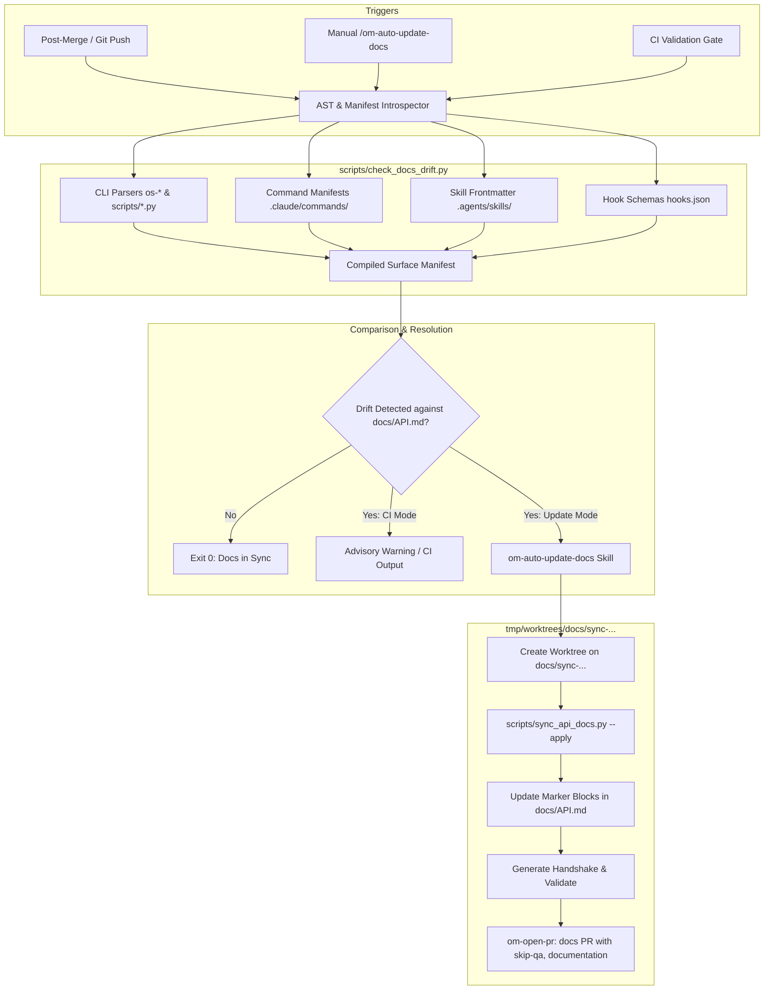

# Automated Documentation Update Pipeline

## 📝 TLDR

This specification defines an autonomous documentation synchronization engine for AGENTS-OS v6.5 Swarm Edition, consisting of a deterministic drift detector (`scripts/check_docs_drift.py`) and an autonomous update skill (`om-auto-update-docs`). The pipeline monitors changes to CLI tools (`os-*`, `scripts/`), slash commands (`.claude/commands/`), hook schemas, and skill definitions, automatically updating `docs/API.md`, `README.md`, and skill indexes via marker-delimited sections and isolated worktree documentation PRs (`skip-qa`, `documentation`), eliminating documentation drift across downstream repositories.

## 📝 Problem Statement

In AGENTS-OS, frameworks and tooling interfaces evolve continuously across multi-agent swarms. Fast-moving code additions—such as new CLI flags in `generate-handshake.py`, PreToolUse interactive hooks in `guard_coordinator_pretool.py`, or new skills in `global_skills/`—frequently land without corresponding updates to `docs/API.md`, `README.md`, or slash command manuals.

### Concrete Evidence:
1. **CLI Signature Desynchronization**: `generate-handshake.py` added `--math-check`, while previous prompt instructions expected `--task`/`--branch`, causing agent validation failures.
2. **Schema Drift**: Hook definitions shifted from simple execution strings to structured PreToolUse matchers, but manual API references lagged behind the implementation.
3. **Downstream Blast Radius**: As a distributor repository, any outdated documentation in `agents-os-core` is cloned into downstream repositories via `os-init` and `os-upgrade-project`, propagating stale operational instructions to secondary agent swarms.
4. **Manual Friction**: While `docs-writer` exists, it requires explicit operator invocation and manual review. `om-auto-update-changelog` addresses only `CHANGELOG.md` upon release, leaving core reference documents unmaintained.

An automated, non-destructive synchronization mechanism is required to detect documentation drift and open structured documentation PRs with zero manual burden.

## 📝 Proposed Solution

We implement a two-tiered automated documentation architecture:

1. **Deterministic Drift Detector (`scripts/check_docs_drift.py`)**:
   - Parses public framework surfaces using Python AST and argparse introspection for Python scripts, Regex/bash parsing for `os-*` scripts, and frontmatter extraction for skills and commands.
   - Extracts current signatures, flags, environment variables, and trigger keywords into a structured memory manifest.
   - Compares current surface signatures against existing documentation in `docs/API.md` and `README.md`.
   - Runs in CI / validation gate in advisory mode (`--check --warn-only`), reporting exact drifted symbols.

2. **Autonomous Documentation Skill (`om-auto-update-docs`)**:
   - Follows the Open-Mercato autonomous pipeline pattern (`om-auto-*`).
   - Replaces marked blocks (`<!-- AUTO_DOC:START:<id> --> ... <!-- AUTO_DOC:END:<id> -->`) in `docs/API.md` with freshly compiled reference tables.
   - Invokes Builder subagent delegation in an isolated worktree (`tmp/worktrees/docs/sync-<timestamp>`).
   - Ships updates via `om-open-pr` as a design/documentation PR labeled `review`, `documentation`, `skip-qa`, `priority-medium`, `risk-low`.

### Alternatives Considered & Rejected:
- **Full LLM Markdown Regeneration**: Rejected due to high token cost, non-deterministic phrasing regressions, and destruction of human-authored architectural prose.
- **Strict Pre-Commit / CI Blocking Gate**: Rejected because blocking emergency hotfixes on documentation formatting introduces unacceptable developer friction.

## Resolved assumptions (autonomous defaults)

| # | Question | Applied default | Why | Confirm? |
|---|----------|-----------------|-----|----------|
| Q1 | Should drift detection block CI merges or run as an advisory report? | Advisory in standard CI (`--check --warn-only`); blocking only when invoked via explicit QA gate command. | Prevents urgent production hotfixes from being blocked by cosmetic doc diffs while alerting developers. | ok |
| Q2 | How should existing markdown files be updated without overwriting manual context? | Marker-delimited blocks (`<!-- AUTO_DOC:START -->` ... `<!-- AUTO_DOC:END -->`) for structured tables + targeted LLM patch for narrative. | Guarantees 100% deterministic safety for reference sections while preserving architectural commentary. | ok |
| Q3 | What execution model should apply to automated documentation updates? | Autonomous PR creation in an isolated Git worktree (`tmp/worktrees/docs/sync-...`) via `om-open-pr`. | Strict adherence to AGENTS-OS R-ROLE-01 and Swarm Triad worktree isolation laws. | ok |
| Q4 | Which repository surfaces are monitored for documentation drift? | CLI tools (`os-*`, `scripts/*.py`), hook schemas (`hooks.json`), slash commands (`.claude/commands/`), and skill frontmatter (`SKILL.md`). | Covers all public developer and agent interfaces without tracking volatile internal test scratch files. | ok |

## 📝 Architecture



### Key Components:
- `scripts/check_docs_drift.py`: Standalone CLI utility to extract signatures and calculate drift checksums.
- `scripts/sync_api_docs.py`: Template renderer that injects structured CLI, Hook, and Command tables into markdown markers.
- `.agents/skills/om-auto-update-docs/`: Skill instructions and operational protocol for autonomous execution.
- `.claude/commands/auto-update-docs.md`: Native slash command for Claude Code and Antigravity IDE.
- `docs/API.md`: Primary reference target embedded with delimited auto-sync blocks.

## 📝 Data Model

### 1. Surface Manifest Schema (`docs_surface_manifest.json`)
Temporary runtime structure emitted by `check_docs_drift.py --dump-json`:

```json
{
  "$schema": "https://agents-os.dev/schemas/docs-manifest.v1.json",
  "version": "1.0.0",
  "generated_at": "2026-09-17T14:30:00Z",
  "commit_sha": "5bf5f6e8c...",
  "surfaces": {
    "cli_tools": [
      {
        "name": "generate-handshake.py",
        "path": "scripts/generate-handshake.py",
        "type": "python",
        "description": "Generates signed handshake JSON for Swarm Triad protocol.",
        "arguments": [
          { "flag": "--role", "required": true, "choices": ["builder", "auditor", "coordinator"] },
          { "flag": "--conversation-id", "required": true, "type": "string" },
          { "flag": "--status", "required": true, "choices": ["SUCCESS", "FAILURE", "PARTIAL"] },
          { "flag": "--math-check", "required": false, "choices": ["PASSED", "FAILED", "SKIPPED", "N/A"] },
          { "flag": "--files", "required": false, "type": "string" },
          { "flag": "--notes", "required": false, "type": "string" }
        ],
        "signature_hash": "a1b2c3d4..."
      }
    ],
    "skills": [
      {
        "name": "om-auto-write-spec",
        "path": ".agents/skills/om-auto-write-spec/SKILL.md",
        "description": "Autonomously turn a brief or FR issue into a spec landed on a ready PR.",
        "category": "agentic-pipeline"
      }
    ],
    "slash_commands": [
      {
        "command": "/grill-me",
        "path": ".claude/commands/grill-me.md",
        "summary": "Pre-flight architectural interview protocol."
      }
    ]
  }
}
```

### 2. Markdown Marker Protocol
Markers placed in `docs/API.md` and `README.md`:

```markdown
<!-- AUTO_DOC:START:CLI_TOOLS -->
| Command | Arguments | Description |
|---|---|---|
... generated rows ...
<!-- AUTO_DOC:END:CLI_TOOLS -->
```

## 📝 API Contracts

### 1. `scripts/check_docs_drift.py` CLI
```bash
python3 scripts/check_docs_drift.py [OPTIONS]
```
- **Options**:
  - `--check`: Returns exit code `1` if drift is detected, `0` if in sync.
  - `--warn-only`: Emits human-readable diff and warnings to stderr but exits `0` (used for standard CI gates).
  - `--dump-manifest <path>`: Writes detected surface manifest to specified JSON path.
  - `--target <path>`: Target documentation file to verify (default: `docs/API.md`).
- **Exit Codes**:
  - `0`: In sync or `--warn-only` active.
  - `1`: Drift detected (when `--check` active).
  - `2`: Syntax/parse error in target files or codebase scripts.

### 2. `scripts/sync_api_docs.py` CLI
```bash
python3 scripts/sync_api_docs.py [OPTIONS]
```
- **Options**:
  - `--apply`: Replaces marker blocks directly in target files.
  - `--dry-run`: Prints unified diff of proposed changes without writing to disk.
  - `--file <path>`: Target markdown file (default: `docs/API.md`).

### 3. Slash Command `/om-auto-update-docs`
- **Invocation**: `/om-auto-update-docs [--dry-run]`
- **Behavior**:
  1. Runs `check_docs_drift.py --check`.
  2. If no drift is detected, reports clean state and terminates.
  3. If drift exists, invokes `om-auto-update-docs` autonomous workflow in an isolated worktree.
  4. Opens PR titled `docs(sync): update documentation for framework surfaces`.

## 📝 UI/UX

This feature operates via developer CLI, GitHub PR interfaces, and agent conversational feedback (no browser/graphical frontend):

1. **Terminal Inspection Output**:
   ```text
   🔍 Checking AGENTS-OS documentation sync against master...
   ⚠️ Drift detected in docs/API.md:
      - [MODIFIED] scripts/generate-handshake.py: missing --math-check argument in table
      - [NEW] .claude/commands/auto-update-docs.md: command not listed in Spis Treści
   Run 'python3 scripts/sync_api_docs.py --apply' or '/om-auto-update-docs' to synchronize.
   ```

2. **Pull Request Presentation**:
   - **Title**: `docs(sync): synchronize API.md and command references`
   - **Labels**: `review`, `documentation`, `skip-qa`, `priority-medium`, `risk-low`
   - **PR Body**:
     ```markdown
     Source doc: docs/API.md
     Status: complete

     ## 🎯 Goal
     - Automatically synchronize API and CLI reference documentation with code changes.

     ## What Changed
     - Regenerated `docs/API.md` section `<!-- AUTO_DOC:START:CLI_TOOLS -->`.
     - Added new CLI argument specifications for `generate-handshake.py`.
     - Updated `.claude/commands/` index.

     ## 💥 Breaking Changes
     - None — documentation update only.
     ```

## 📝 Edge Cases & Failure Scenarios

1. **Corrupted or Missing Markers**:
   - *Failure*: A contributor accidentally removes `<!-- AUTO_DOC:END:CLI_TOOLS -->`.
   - *Handling*: `sync_api_docs.py` verifies pair symmetry before making modifications. If an unclosed marker is detected, the script raises an explicit error and aborts without mutating the file.
2. **Script Parse Failure (Syntax Errors)**:
   - *Failure*: A developer introduces invalid Python/Bash syntax in a script under `scripts/`.
   - *Handling*: `check_docs_drift.py` wraps AST parsing in try-except blocks, flags the problematic file as unparseable, and exits with code `2`, preventing partial or broken doc generation.
3. **Concurrent Documentation Updates**:
   - *Failure*: Another branch modified manual prose in `docs/API.md` simultaneously.
   - *Handling*: Because changes are confined to isolated worktrees and isolated marker blocks, Git's standard 3-way merge cleanly merges auto-doc blocks without conflicting with adjacent prose.
4. **No Drift Present**:
   - *Handling*: If surfaces match existing documentation hashes, `om-auto-update-docs` exits cleanly with `Status: no-op`, avoiding phantom empty commits or redundant PRs.

## 📝 Risks & Impact Review

- **Blast Radius**: Low. The pipeline touches exclusively `.md` documentation files (`docs/API.md`, `README.md`). No runtime production code or execution logic is modified.
- **Security & Secrets Hygiene**: Introspection scripts only inspect script signatures and markdown frontmatter. No environment variable values or private keys are inspected or leaked into generated documentation.
- **Rollback Strategy**: Standard Git revert of the documentation commit or closing the generated PR. Zero database migrations or deployment rollbacks required.
- **Backward Compatibility**: Fully compatible with existing installations. Markdown markers render invisibly in GitHub, Antigravity, and VS Code preview renderers.

## 📋 Phasing

### Phase 1: Introspection Engine & Markers
- Build `scripts/check_docs_drift.py` for AST and CLI inspection.
- Add marker blocks (`<!-- AUTO_DOC:START:... -->`) to `docs/API.md`.
- Verify signature hashing and deterministic diff reporting.

### Phase 2: Synchronization Utility & CI Gate
- Implement `scripts/sync_api_docs.py` to render and inject markdown tables.
- Add unit and integration tests for marker preservation and edge-case handling.
- Register `check_docs_drift.py --warn-only` in `.ai/agentic.config.json` validation commands.

### Phase 3: Autonomous Skill & Slash Command
- Author `.agents/skills/om-auto-update-docs/SKILL.md` following Open-Mercato autonomous pipeline conventions.
- Add `.claude/commands/auto-update-docs.md` slash command.
- Add end-to-end drift-to-PR integration test.

## 📋 Implementation Plan

### Phase 1: Introspection Engine
- **Step 1**: Implement `scripts/check_docs_drift.py` supporting Python AST inspection of `scripts/*.py` and regex extraction of `os-*` scripts.
- **Step 2**: Add support for parsing `.claude/commands/*.md` and `.agents/skills/*/SKILL.md` frontmatter metadata.
- **Step 3**: Inject initial `<!-- AUTO_DOC:START:CLI_TOOLS -->` and `<!-- AUTO_DOC:START:COMMANDS -->` markers into `docs/API.md`.

### Phase 2: Synchronization Utility
- **Step 4**: Implement `scripts/sync_api_docs.py` to compile Markdown tables from the extracted manifest and apply updates within delimited blocks.
- **Step 5**: Implement `--dry-run` and symmetry validation (abort on missing closing tags).
- **Step 6**: Add test suite `tests/test_docs_sync.py` verifying marker preservation, idempotence, and exit codes.

### Phase 3: Pipeline Integration & Skill Authoring
- **Step 7**: Update `.ai/agentic.config.json` to include `python3 scripts/check_docs_drift.py --warn-only` in validation commands.
- **Step 8**: Create `.agents/skills/om-auto-update-docs/SKILL.md` orchestrating worktree creation, update execution, handshake generation, and `om-open-pr` invocation.
- **Step 9**: Create `.claude/commands/auto-update-docs.md` slash command definition.
- **Step 10**: Run full test suite and validate end-to-end drift detection.
