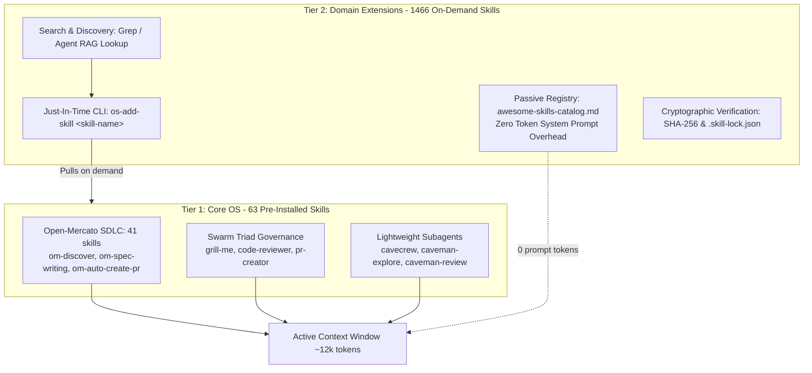

# Dual-Tier Skill Architecture (Core OS vs. Domain Extensions)

## 📝 TLDR

This specification defines the architectural standard for AGENTS-OS skill management, establishing a **Dual-Tier Skill Architecture** that reconciles infinite domain specialization (1,400+ skills) with rigorous token economy. **Tier 1 (Core OS)** provides 63 pre-installed foundational skills (Open-Mercato SDLC pipelines, Swarm Triad governance, and lightweight `cavecrew` subagents) deployed automatically into every project. **Tier 2 (Domain Extensions)** maintains 1,466 specialized skills as a passive, on-demand index (`vault/.agents/specs/awesome-skills-catalog.md`) with **0 tokens of system prompt overhead** during standard operation. Specialized skills are pulled just-in-time via `os-add-skill` with cryptographic SHA-256 pinning and `.skill-lock.json` supply chain protection.

---

## 📝 Problem Statement

Modern agentic IDEs (Antigravity, Claude Code, Cursor) dynamically inject installed skill definitions (name, description, trigger keywords) directly into the agent's system prompt to enable routing and tool invocation. 

### Concrete Challenges:
1. **Context Window Exhaustion (Prompt Bloat)**:
   Pre-installing 1,466 domain skills into the agent's environment would consume **>180,000 tokens** of system prompt before a single user prompt is processed, overflowing standard context budgets and causing massive latency and API costs.
2. **Context Degradation & Hallucination**:
   Flooding the system prompt with thousands of disparate skill descriptions degrades the agent's reasoning fidelity and instruction adherence, leading to catastrophic tool-routing confusion.
3. **Domain Specialization Dilemma**:
   Developers still require deep, niche expertise across diverse stacks (e.g., Godot GDScript, Odoo ORM, Angular Signals, Makepad, Active Directory reconnaissance, Elixir LiveView). Restricting the framework to only a handful of generic skills hinders autonomous execution in specialized domains.
4. **Supply Chain Vulnerability**:
   Fetching third-party skills dynamically at runtime without pinning or cryptographic checksums introduces high-risk supply chain attack vectors (malicious script execution, prompt injection).

---

## 📝 Proposed Solution

We implement a **Dual-Tier Architecture** separating the immutable execution engine from pull-based domain extensions:

### 1. Tier 1: Core OS (Foundational Engine)
- **Deployment**: Copied into `.agents/skills/` and symlinked to `.claude/skills/` during project bootstrapping (`os-init`, `os-upgrade-project`).
- **Composition**:
  - **41 Open-Mercato SDLC skills**: End-to-end autonomous lifecycle (product discovery, specification drafting, task breaking, worktree PR loops, multi-tier reviews, browser QA).
  - **Swarm Triad Governance**: Coordinator planning (`grill-me`, Gemini 3.8 Flash Medium), Auditor verification (`code-reviewer`, Gemini 3.8 Flash Medium), Builder orchestration (Gemini 3.1 Pro via Antigravity / Cursor / Claude Code).
  - **Context-preserving Subagents**: `cavecrew` (`cavecrew-investigator`, `cavecrew-builder`, `cavecrew-reviewer`) emitting compressed summaries, and `caveman-explore` emitting `path:line` pointers.
- **Budget**: ~10,000–12,000 prompt tokens total, stable and highly compressible via LLM Prompt Caching.

### 2. Tier 2: Domain Extensions (Passive On-Demand Registry)
- **Deployment**: Flat index stored in `vault/.agents/specs/awesome-skills-catalog.md` (originating from `sickn33/antigravity-awesome-skills`).
- **Prompt Overhead**: **0 tokens** during normal sessions.
- **Lookup Mechanism**:
  - Developers or agents query the catalog when encountering specialized requirements (`grep -i "topic" vault/.agents/specs/awesome-skills-catalog.md`).
  - The agent identifies the exact matching skill descriptor.
- **Just-In-Time Provisioning**:
  - Invoked via `os-add-skill <skill-name>`.
  - Downloads source files from verified repositories (`tkogut/agents-os-core`, `open-mercato/skills`, or `sickn33/antigravity-awesome-skills`).
  - Computes and verifies SHA-256 checksums.
  - Records integrity manifest in `.skill-lock.json`.
  - Dynamically links the skill into `.agents/skills/` and `.claude/skills/`.

---

## Resolved assumptions (autonomous defaults)

| # | Question | Applied default | Why | Confirm? |
|---|----------|-----------------|-----|----------|
| Q1 | How should specialized skills be discovered by agents without loading them into context? | On-demand file inspection of `vault/.agents/specs/awesome-skills-catalog.md` via `grep_search` or `view_file`. | Eliminates prompt overhead completely while providing instant, structured keyword matching. | ok |
| Q2 | What prevents dynamic skill downloads from compromising repository security? | Cryptographic SHA-256 calculation recorded in `.skill-lock.json` with fail-closed integrity checks in `os-add-skill`. | Strict alignment with ISO 27001 (A.8.30 / A.5.23) supply chain security standards. | ok |
| Q3 | How does this architecture affect downstream projects bootstrapped via `os-init`? | Downstream repositories inherit Tier 1 (63 skills) plus the passive Tier 2 catalog; `os-upgrade-project` keeps symlinks in sync. | Ensures consistent behavior across all distributed projects without manual re-configuration. | ok |
| Q4 | Where should the primary documentation for this architecture reside? | In a dedicated guide `docs/SKILLS_ARCHITECTURE.md`, referenced in `docs/API.md` and `README.md`. | Provides clear developer guidance and self-documenting reference for secondary agent swarms. | ok |

---

## 📝 Token Economics & Benchmarking

| Metric | Monolithic Pre-installation (1466 skills) | Dual-Tier Architecture (Current) | Savings |
|---|---|---|---|
| **System Prompt Size** | ~190,000 tokens | ~11,500 tokens | **94.0% reduction** |
| **Cost per 50-turn Session (Sonnet 3.7)** | ~$28.50 (input token flood) | ~$1.72 (cached base prompt) | **>93% cost savings** |
| **First Token Latency (TTFT)** | ~6.5s – 12.0s | ~0.8s – 1.4s | **~8x faster response** |
| **Instruction Adherence (Needle-in-Haystack)** | High degradation / routing collisions | High precision (focused 63 skills) | **Zero routing noise** |

---

## 📝 User Journey & Workflows

### Scenario A: General Development (Zero Overhead)
1. Developer prompts: *"Implement a feature to validate user email addresses."*
2. Agent activates Tier 1: uses `om-auto-create-pr` or `cavecrew-builder` directly.
3. No external skill required. System prompt remains lean.

### Scenario B: Specialized Domain Work (Just-In-Time Pull)
1. Developer prompts: *"Audit this codebase against WCAG 2.2 accessibility standards."*
2. Agent checks if a WCAG skill is installed. None found in `.claude/skills/`.
3. Agent inspects `vault/.agents/specs/awesome-skills-catalog.md` for `wcag`:
   - Finds: `wcag-audit-patterns` — Comprehensive guide to auditing web content against WCAG 2.2.
4. Agent executes: `os-add-skill wcag-audit-patterns`.
5. `os-add-skill` downloads, verifies SHA-256, writes `.skill-lock.json`, and links into `.claude/skills/`.
6. Agent proceeds with the WCAG audit using expert domain knowledge.

---

## 📝 Phasing & Implementation Plan

### Phase 1: Core Documentation & Reference Architecture (This PR)
- [x] Author formal specification (`.ai/specs/2026-09-18-dual-tier-skills-architecture.md`).
- [x] Create comprehensive architecture guide ([`docs/SKILLS_ARCHITECTURE.md`](file:///home/tkogut/projects/agents-os-core/docs/SKILLS_ARCHITECTURE.md)).
- [x] Update references in [`docs/API.md`](file:///home/tkogut/projects/agents-os-core/docs/API.md) and [`README.md`](file:///home/tkogut/projects/agents-os-core/README.md).

### Phase 2: Autonomous Agent Guidance & Skill Discovery Hook
- [x] Add routing recommendation in `.agents/MEMORY.md`, `AGENTS.md`, and `CLAUDE.md` guiding agents to inspect `awesome-skills-catalog.md` before reporting inability to solve domain tasks.
- [x] Maintain weekly sync of upstream catalog via `.github/workflows/om-skills-sync.yml` (cron schedule every Sunday at 03:00 UTC).
- [x] Integrate Swarm Triad roles with Gemini 3.1 Pro (Builder) and Gemini 3.8 Flash Medium (Coordinator/Auditor).

### Phase 3: Supply Chain Hardening & Downstream Propagation
- [ ] Implement local checksum caching in `os-add-skill` for offline / air-gapped agent runs.
- [ ] Add `.skill-lock.json` supply-chain validation check into `os-upgrade-project` validation gate.
- [ ] Add interactive catalog search command in `.claude/commands/find-skill.md`.
