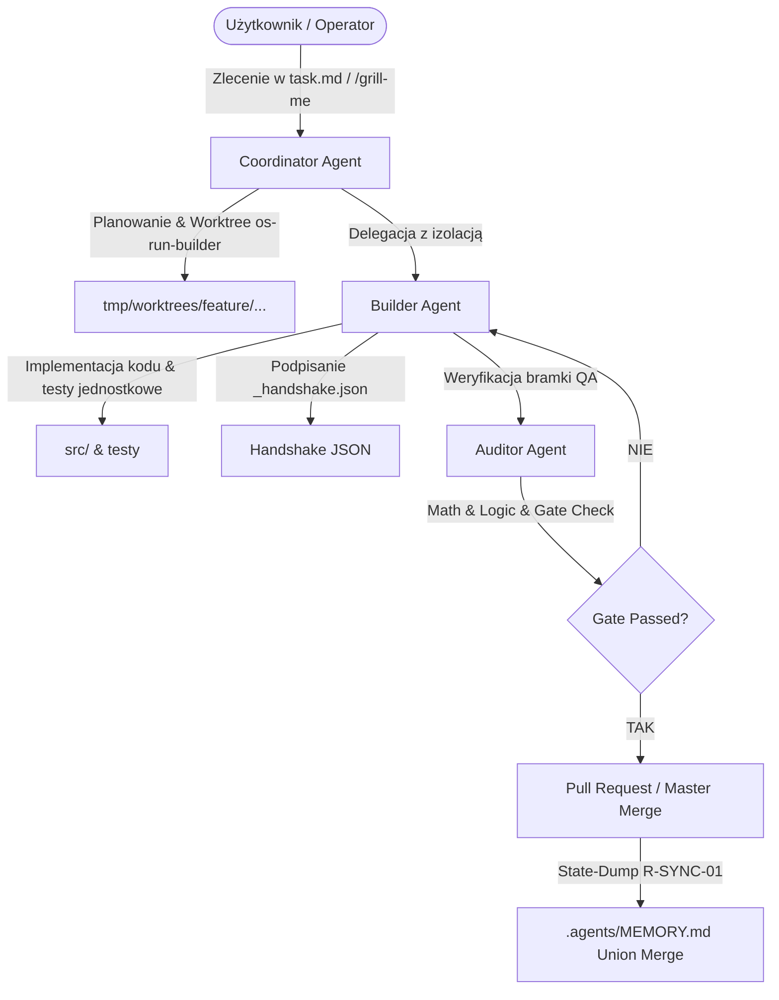

# 🛸 AGENTS-OS v6.5 Swarm Edition — API & CLI Reference

> **Dokumentacja Techniczna i Referencja Interfejsów CLI / API dla AGENTS-OS v6.5**  
> Zgodność ze standardem: `Swarm Triad`, `Open-Mercato SDLC`, `Cezar Runtime`.

---

## 📑 Spis Treści

1. [Przegląd Architektury (Architecture Overview)](#1-przegląd-architektury)
2. [Referencja Komend CLI (CLI Tools)](#2-referencja-komend-cli)
   - [`os-init`](#os-init)
   - [`os-init-claude`](#os-init-claude)
   - [`os-upgrade-project`](#os-upgrade-project)
   - [`os-add-skill`](#os-add-skill)
   - [`os-run-builder`](#os-run-builder)
   - [`grill-me` (`/grill-me`)](#grill-me)
   - [`generate-handshake.py`](#generate-handshakepy)
   - [`validate-handshakes.py`](#validate-handshakespy)
3. [Schematy Plików i Formatów Danych](#3-schematy-plików-i-formatów-danych)
   - [Pamięć rozproszona: `.agents/MEMORY.md`](#memorymd)
   - [Handshake Triady: `*_handshake.json`](#handshakejson)
   - [Konfiguracja ról: `agents.yaml`](#agentsyaml)
   - [Reguły bezkonfliktowe: `.gitattributes`](#gitattributes)
   - [Pipeline Gate: `.ai/agentic.config.json`](#agenticconfigjson)
   - [Hooki cyklu życia: `hooks.json`](#hooksjson)
4. [Protokoły i Żelazne Zasady](#4-protokoły-i-żelazne-zasady)

---

## 1. Przegląd Architektury

AGENTS-OS v6.5 Swarm Edition to rozproszony framework koordynacji agentów AI (Antigravity IDE, Claude Code, Cursor, Zed) działający w modelu asynchronicznym (Swarm Triad):



### Role Swarm Triad:
- **Coordinator**: Analiza wymagań, pre-flight `/grill-me`, podział zadań w `task.md`, alokacja `tmp/worktrees/`. **Kategoryczny zakaz edycji kodu `src/`**.
- **Builder**: Implementacja w izolowanym worktree, uruchamianie komend kompilacji/testów, generowanie `_handshake.json`.
- **Auditor**: Niezależna weryfikacja logiki, testy regresji, walidacja podpisów handshake, ocena zgodności architektonicznej.

---

## 2. Referencja Komend CLI

### `os-init`

Inicjalizuje nowy projekt produkcyjny w oparciu o szablon Złotego Standardu (Vault), tworzy repozytorium GitHub i otwiera Antigravity IDE w środowisku WSL:Ubuntu.

```bash
os-init <project-name>
```

#### Parametry Wejściowe:
- `<project-name>` *(string, wymagany)*: Nazwa nowego repozytorium i katalogu w `~/projects/`.

#### Zachowanie / Efekty Uboczne:
1. Kopiuje strukturę `~/.antigravity/templates/vault` do `~/projects/<project-name>`.
2. Tworzy `.gitignore`, `README.md`, `.gitattributes` (`merge=union`).
3. Wykonuje `git init`, `git add -A`, tworzy initial commit.
4. Tworzy publiczne repozytorium GitHub przez `gh repo create` i wykonuje `git push origin main`.
5. Mapuje symlinki `.claude/skills/*` do `.agents/skills/*`.
6. Otwiera Antigravity IDE (`antigravity .`) i przechodzi do katalogu w bieżącym terminalu.

#### Kody Wyjścia:
- `0`: Sukces.
- `1`: Błąd (brak nazwy projektu, brak `gh`, błąd uprawnień).

---

### `os-init-claude`

Inicjalizuje nowy projekt zoptymalizowany pod Claude Code oraz edytor VS Code.

```bash
os-init-claude <project-name>
```

#### Parametry Wejściowe:
- `<project-name>` *(string, wymagany)*: Nazwa katalogu projektu.

#### Cechy Specyficzne dla Claude Code:
- Generuje plik `CLAUDE.md` z wytycznymi systemowymi.
- Instaluje natywne slash commands w `.claude/commands/` (`/worktree-init`, `/handshake`, `/qa-gate`, `/commit`, `/grill-me`).
- Oznacza rolę `claude-code` jako `primary_builder` w `agents.yaml`.
- Otwiera projekt poleceniem `code .`.

---

### `os-upgrade-project`

Migruje istniejące repozytorium do standardu **AGENTS-OS v6.5 Swarm Edition** z obsługą bezkonfliktowej synchronizacji wielomaszynowej.

```bash
os-upgrade-project [target-directory]
```

#### Parametry Wejściowe:
- `[target-directory]` *(string, opcjonalny)*: Ścieżka do aktualizowanego projektu. Domyślnie bieżący katalog roboczy (`pwd`).

#### Wykonywane Kroki:
1. **`.gitattributes`**: Wstrzykuje reguły `merge=union` dla `.agents/MEMORY.md`, `.agents/task.md`, `MEMORY.md` i `task.md`.
2. **Konfiguracja Git**: Ustawia lokalnie `pull.rebase=true` oraz `merge.conflictstyle=diff3`.
3. **Hooki Cyklu Życia**: Generuje pliki `hooks.json` w `.antigravity/`, `.gemini/` i `.agents/` (automatyczny `git pull --rebase` na start i commit/push zrzutu pamięci na stop).
4. **Symlinki Claude Code**: Tworzy dowiązania `ln -sf` ze wszystkich `.agents/skills/*` do `.claude/skills/`.
5. **Silnik Pamięci**: Inicjalizuje `.agents/MEMORY.md` (v0.42.1) oraz `.agents/task.md` jeśli nie istnieją.
6. **Synchronizacja Skilli**: Kopiuje brakujące skille z szablonu bazowego.

---

### `os-add-skill`

Dynamicznie dociąga skille z rejestrów RAG oraz bazy 1400+ skilli społecznościowych bezpośrednio do projektu.

```bash
os-add-skill <skill-name>
```

#### Parametry Wejściowe:
- `<skill-name>` *(string, wymagany)*: Identyfikator skilla (np. `postgresql-optimization`, `om-code-review`, `vps-ops`).

#### Kolejność Wyszukiwania (Fallback Resolution):
1. **Lokalny Vault**: `~/.antigravity/templates/vault/.agents/skills/<skill-name>`
2. **Repozytorium Główne**: `tkogut/agents-os-core/global_skills/<skill-name>`
3. **Rejestr Społeczności**: `sickn33/antigravity-awesome-skills/skills/<skill-name>`

#### Automatyczne Linkowanie:
Po pobraniu skrypt automatycznie tworzy symlink w `.claude/skills/<skill-name>`, zapewniając natychmiastową widoczność w Claude Code i Antigravity.

---

### `os-run-builder`

Automatyzuje tworzenie i podpinanie izolowanego środowiska **Git Worktree** dla roli Builder.

```bash
os-run-builder <branch-name>
```

#### Parametry Wejściowe:
- `<branch-name>` *(string, wymagany)*: Nazwa gałęzi funkcyjnej (np. `feature/order-api`).

#### Zachowanie:
- Wykonuje `git worktree prune` (usuwa martwe referencje).
- Tworzy katalog `./tmp/worktrees/<branch-name>` i podpina nową lub istniejącą gałąź.
- Zwraca ścieżkę roboczą do przekazania subagentowi Builder jako parametr `Workspace`.

---

### `grill-me`

Fizyczny skrypt wykonywalny oraz slash command (`/grill-me`) realizujący protokół rygoru architektonicznego przed rozpoczęciem implementacji.

```bash
# Uruchomienie bezpośrednie CLI:
node .agents/skills/grill-me.js
# lub fallback Python:
python3 .agents/skills/grill-me/scripts/grill_me.py

# Uruchomienie w sesji agenta:
/grill-me
```

#### 5 Pytań Pre-Flight:
1. **Topologia Maszyn & Dystrybucja Węzłów**: Wyznaczenie węzła wiodącego (WSL, VPS, Desktop) i wyłączności wdrożeń.
2. **Bezkonfliktowa Synchronizacja**: Weryfikacja `merge=union` w `.gitattributes` i polityki `pull.rebase=true`.
3. **Stan Bazy Danych & Wartości Domyślne**: Odporność na brak połączenia (Defensive Hybrid, Factory Defaults, kody 501 Fail-Closed).
4. **Krytyczne Przypadki Brzegowe**: Limity API, ujemne marginesy, split-brain, Circuit Breakers i Cooldowns.
5. **Zrzut Stanu (R-SYNC-01)**: Wymóg zapisu pamięci w `.agents/MEMORY.md` i podpisu `_handshake.json`.

---

### `swarm-onboarding` (`/swarm-onboarding`)

Uniwersalny protokół onboardingu i synchronizacji kontekstu dla dowolnego nowego agenta (Antigravity, Claude Code, Cursor) dołączającego do projektu. Bada stan Gita, czyta SSOT `.agents/MEMORY.md`, `task.md` (w tym odrzucone hipotezy i zakazy), pliki planów oraz reguły bezpieczeństwa.

```bash
# Uruchomienie bezpośrednie CLI:
python3 .agents/skills/swarm-onboarding/scripts/onboard.py

# Uruchomienie w czacie agenta:
/swarm-onboarding

# Instalacja w dowolnym projekcie AGENTS-OS:
os-add-skill swarm-onboarding
```

---

### `generate-handshake.py`

Generuje podpisany kryptograficznie/strukturalnie plik handshake JSON dla protokołu Swarm Triad.

```bash
python3 scripts/generate-handshake.py \
  --role {builder,auditor,coordinator} \
  --conversation-id <UUID> \
  --status {SUCCESS,FAILURE,PARTIAL} \
  [--files <file1,file2,...>] \
  [--math-check {PASSED,FAILED,SKIPPED,N/A}] \
  [--notes "Opis wykonanych prac"]
```

#### Plik Wyjściowy:
`.agents/swarm/<conversation-id>_<role>_handshake.json`

---

### `validate-handshakes.py`

Weryfikuje poprawność łańcucha podpisów przed scaleniem gałęzi lub wykonaniem commita.

```bash
python3 scripts/validate-handshakes.py --conversation-id <UUID>
```

#### Kody Wyjścia:
- `0`: Handshake poprawny.
- `1`: Brak wymaganych plików handshake lub status `FAILURE`.
- `2`: Naruszenie reguły izolacji ról (`DIRECT_COORDINATOR_EDIT_FORBIDDEN`).

---

## 3. Schematy Plików i Formatów Danych

### `.agents/MEMORY.md`

Główny rejestr pamięci operacyjnej Swarm w standardzie append-only / union merge.

```markdown
# 🧠 AGENTS-OS v6.5 SWARM MEMORY ENGINE (v0.42.1)

---
version: 0.42.1
schema: agents-os-memory-v1
sync_mode: distributed-union
last_sync: 2026-09-09T08:00:00Z
---

## 🧭 Swarm Node & Machine Registry
- **Active Node**: Local Workspace (Swarm Builder)
- **Sync Protocol**: Native Git Union Merge (.gitattributes)
- **Lifecycle Triggers**: SessionStart (rebase pull) / SessionEnd (auto state-dump push)

## 📌 Epics & Persistent Context
- **Active Epic**: ...

## 📝 Decisions & Key Milestones
- [2026-09-09] ...

## 🔄 Machine Session Log
- [2026-09-09 08:00 UTC] [Node-ID] [Role] Opis wykonanej operacji.
```

---

### `*_handshake.json`

Format pliku wymiany stanu pomiędzy rolami Swarm Triad:

```json
{
  "conversation_id": "9396bb06-1200-4c8d-9686-23acccdf4d5b",
  "role": "Builder Agent",
  "status": "SUCCESS",
  "files_modified": [
    "src/controllers/order.ts",
    "tests/order.test.ts"
  ],
  "math_consistency_check": "PASSED",
  "timestamp": "2026-09-09T08:00:00Z",
  "notes": "Zaimplementowano API zamówień wraz z pokryciem testowym 100%."
}
```

---

### `.gitattributes`

Reguły bezkonfliktowego automatycznego scalania w środowisku rozproszonym:

```gitattributes
# AGENTS-OS v6.5 Swarm Edition - Distributed Auto-Sync Rules
.agents/MEMORY.md merge=union
.agents/task.md merge=union
MEMORY.md merge=union
task.md merge=union
```

---

### `.ai/agentic.config.json`

Konfiguracja pipeline'u walidacji, bramek jakościowych i ról:

```json
{
  "$schema": "https://agents-os.dev/schemas/agentic.config.v1.json",
  "version": "6.5.0",
  "pipeline": {
    "default_branch": "master",
    "gates": {
      "lint": "npm run lint",
      "typecheck": "npm run typecheck",
      "test": "npm test",
      "build": "npm run build"
    },
    "qa": {
      "require_evidence": true,
      "browser_provider": "playwright"
    }
  },
  "roles": {
    "coordinator": { "can_edit_src": false },
    "builder": { "can_edit_src": true, "require_worktree": true },
    "auditor": { "can_edit_src": false, "require_handshake_validation": true }
  }
}
```

---

### `hooks.json`

Konfiguracja natywnych hooków cyklu życia agenta (`.antigravity/hooks.json` / `.gemini/hooks.json` / `.agents/hooks.json`) z wbudowaną ochroną gałęzi produkcyjnych (`main`/`master`):

```json
{
  "distributed-sync": {
    "SessionStart": [
      {
        "type": "command",
        "command": "CURR=$(git rev-parse --abbrev-ref HEAD 2>/dev/null || echo ''); if [ -n \"$CURR\" ] && [ \"$CURR\" != \"HEAD\" ]; then git pull origin \"$CURR\" --rebase || true; fi",
        "timeout": 30
      }
    ],
    "SessionEnd": [
      {
        "type": "command",
        "command": "CURR=$(git rev-parse --abbrev-ref HEAD 2>/dev/null || echo ''); if [ -n \"$CURR\" ] && [ \"$CURR\" != \"main\" ] && [ \"$CURR\" != \"master\" ] && [ \"$CURR\" != \"HEAD\" ]; then git add .agents/MEMORY.md .agents/task.md 2>/dev/null && git commit -m \"chore(sync): automatyczny zrzut pamięci i stanu sesji [skip ci]\" 2>/dev/null && git push origin \"$CURR\" 2>/dev/null || true; else echo \"ℹ️ [Auto-Sync] Pomijam push do remote na gałęzi $CURR (ochrona main/master)\"; fi",
        "timeout": 30
      }
    ],
    "PreInvocation": [
      {
        "type": "command",
        "command": "CURR=$(git rev-parse --abbrev-ref HEAD 2>/dev/null || echo ''); if [ -n \"$CURR\" ] && [ \"$CURR\" != \"HEAD\" ]; then git pull origin \"$CURR\" --rebase || true; fi",
        "timeout": 30
      }
    ],
    "Stop": [
      {
        "type": "command",
        "command": "CURR=$(git rev-parse --abbrev-ref HEAD 2>/dev/null || echo ''); if [ -n \"$CURR\" ] && [ \"$CURR\" != \"main\" ] && [ \"$CURR\" != \"master\" ] && [ \"$CURR\" != \"HEAD\" ]; then git add .agents/MEMORY.md .agents/task.md 2>/dev/null && git commit -m \"chore(sync): automatyczny zrzut pamięci i stanu sesji [skip ci]\" 2>/dev/null && git push origin \"$CURR\" 2>/dev/null || true; else echo \"ℹ️ [Auto-Sync] Pomijam push do remote na gałęzi $CURR (ochrona main/master)\"; fi",
        "timeout": 30
      }
    ]
  }
}
```

---

## 4. Protokoły i Żelazne Zasady

1. **R-ROLE-01 (Coordinator Safety Gate)**: Agent w roli Coordinatora ma absolutny zakaz bezpośredniej modyfikacji plików kodu (`src/`). Wszelkie zmiany implementacyjne muszą być delegowane do subagenta Builder w odizolowanym katalogu `tmp/worktrees/`.
2. **R-SYNC-01 (State-Dump Mandate)**: Przed zakończeniem sesji roboczej i raportem do użytkownika, agent ma bezwzględny obowiązek zrzucić stan pamięci do `.agents/MEMORY.md` i wygenerować plik handshake.
3. **R-MERGE-01 (Union-Merge Consistency)**: Wszelkie logi sesji w `MEMORY.md` muszą mieć charakter dopisujący (append-only), zapobiegający konfliktom podczas jednoczesnej pracy agentów na wielu maszynach.
4. **R-QA-01 (Auditor Validation)**: Żaden pull request ani bezpośrednie scalenie do gałęzi głównej nie może nastąpić bez zatwierdzenia przez Auditora i przejścia pełnego zestawu testów bramki jakościowej (`execution/test_bootstrap.sh` lub testów repozytorium).
