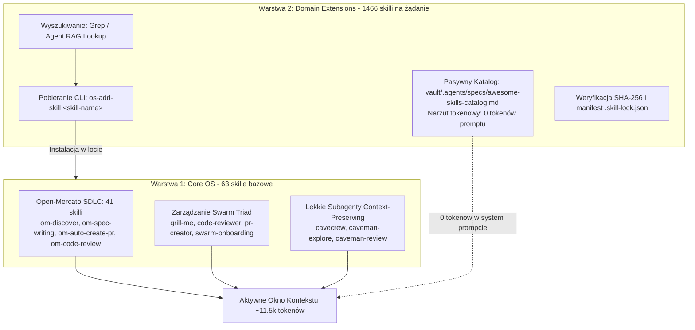

# 🏛️ Architektura Skilli AGENTS-OS: Model Dwuwarstwowy (Dual-Tier)

AGENTS-OS v6.5 rozwiązuje odwieczny dylemat agentowych środowisk programistycznych: **jak zapewnić asystentom AI dostęp do tysięcy wąskich kompetencji dziedzinowych bez zapchania okna kontekstowego (Prompt Bloat) i degradacji myślenia?**

Odpowiedzią jest **Architektura Dwuwarstwowa (Dual-Tier Skill Architecture)**:
1. **Warstwa 1 (Core OS)**: 63 preinstalowane, zoptymalizowane pod Prompt Caching skille systemowe.
2. **Warstwa 2 (Domain Extensions)**: Pasywny katalog 1 466 skilli specjalistycznych, dociąganych w trybie **Just-in-Time (On-Demand)** przy **zerowym narzucie tokenowym** w standardowej pracy.

---

## 🧭 Diagram Architektury



---

## 🚀 Warstwa 1: Core OS (Fundament Systemu)

Zainstalowana w każdym projekcie zarządzanym przez AGENTS-OS (`os-init`, `os-upgrade-project`). Zawiera wyłącznie uniwersalne narzędzia cyklu wytwórczego i koordynacji rojami agentów:

- **41 skilli Open-Mercato (OM)**: Kompletny proces inżynierski od fazy pomysłu po release:
  - *Product Discovery*: `om-discover`, `om-synthetic-users`, `om-mockup-prototype`, `om-backlog`.
  - *Architektura i specyfikacje*: `om-spec-writing`, `om-auto-write-spec`.
  - *Autonomiczne pętle wykonawcze*: `om-auto-create-pr`, `om-auto-create-pr-loop`, `om-auto-fix-issue`.
  - *Weryfikacja i QA*: `om-code-review`, `om-auto-review-pr`, `om-auto-qa-pr`, `om-ux-review-pr`.
  - *Release*: `om-check-and-commit`, `om-approve-merge-pr`, `om-auto-update-changelog`.
- **Swarm Triad Governance**:
  - `grill-me`: Protokół wywiadu architektonicznego i wymóg Human-in-the-Loop.
  - `code-reviewer`: Formalny audytor dla roli Auditor.
  - `swarm-onboarding`: Błyskawiczny briefing kontekstowy dla nowych agentów.
- **Oszczędne Subagenty (`cavecrew`)**:
  - `cavecrew-investigator`: Zwraca wyłącznie zwięzłe syntetyczne wyniki (~700 tokenów zamiast 2-3k opisu).
  - `caveman-explore`: Zwraca precyzyjne odnośniki `path:line` bez wklejania całych plików.
  - `caveman-review`: Jednolinijkowe komentarze audytowe.

### 💰 Ekonomia Tokenowa Warstwy 1:
- Zajmuje jedynie **~11 500 tokenów** w system prompcie.
- Dzięki stabilności definicji, nowoczesne modele (Claude 3.5/3.7, Gemini 2.0) korzystają z **Prompt Cachingu** (zniżka 90% kosztu input tokenów).

---

## 📦 Warstwa 2: Domain Extensions (Katalog Dziedzinowy Na Żądanie)

Reprezentowana przez plik [`vault/.agents/specs/awesome-skills-catalog.md`](file:///home/tkogut/projects/agents-os-core/vault/.agents/specs/awesome-skills-catalog.md) (1 466 skilli ze społecznościowego repozytorium `sickn33/antigravity-awesome-skills`).

### Dlaczego katalog pasywny?
Gdyby 1 466 skilli było załadowanych na stałe do IDE:
- System prompt spuchłby o **ponad 180 000 tokenów**.
- Koszt 50 interakcji wzrósłby z ~$1.70 do **ponad $28.00**.
- Czas do pierwszego tokena (TTFT) wzrósłby z 1 sekundy do **8–12 sekund**.
- Model doznałby zjawiska *context degradation* i myliłby narzędzia.

Jako pasywny plik Markdown na dysku:
- **Koszt w standardowej pracy: 0 tokenów.**

---

## 🛠️ Jak Działa Przepływ Pracy (Workflow On-Demand)?

### Krok 1: Wyszukanie w Katalogu
Gdy projekt wymaga specjalistycznej wiedzy (np. audyt dostępności WCAG, konfiguracja n8n, specyfika Odoo ORM, wzorce Godot GDScript czy bezpieczeństwo Active Directory):
```bash
# Szybkie wyszukanie słowa kluczowego w rejestrze:
grep -i "wcag" vault/.agents/specs/awesome-skills-catalog.md
# Zwraca: `wcag-audit-patterns` | Comprehensive guide to auditing web content...
```

### Krok 2: Instalacja przez `os-add-skill`
```bash
os-add-skill wcag-audit-patterns
```

### Krok 3: Automatyczna Integracja i Bezpieczeństwo
1. `os-add-skill` szuka skilla w kolejności:
   - `tkogut/agents-os-core` (`global_skills/`)
   - `open-mercato/skills` (`skills/`)
   - `sickn33/antigravity-awesome-skills` (`skills/`)
2. Weryfikuje sumy kontrolne SHA-256 pobranych plików i zapisuje wpis w `.skill-lock.json` (zgodność z ISO 27001 / ochrona łańcucha dostaw).
3. Tworzy dowiązania symboliczne do `.agents/skills/` oraz `.claude/skills/`.
4. Skill staje się **natychmiast widoczny i aktywny** dla Claude Code, Antigravity i Cursor w danym projekcie.

---

## 📊 Porównanie: Monolit vs Architektura Dwuwarstwowa

| Parametr | Monolit (Wszystkie 1466 na stałe) | Model Dwuwarstwowy AGENTS-OS | Zysk |
|---|---|---|---|
| **Rozmiar System Promptu** | ~190 000 tokenów | ~11 500 tokenów | **-94% redukcji** |
| **Koszt sesji (50 tur Sonnet)** | ~$28.50 | ~$1.72 | **>93% taniej** |
| **Czas odpowiedzi (TTFT)** | ~8.0s – 12.0s | ~0.9s – 1.4s | **~8x szybciej** |
| **Precyzja routingu narzędzi** | Niska (kolizje setek triggerów) | Bezbłędna (czysty, zwięzły zestaw) | **Brak halucynacji** |
| **Dostęp do niszowej wiedzy** | Ograniczony limitami promptu | Pełny (1 400+ skilli pod komendą) | **Nieograniczony** |
