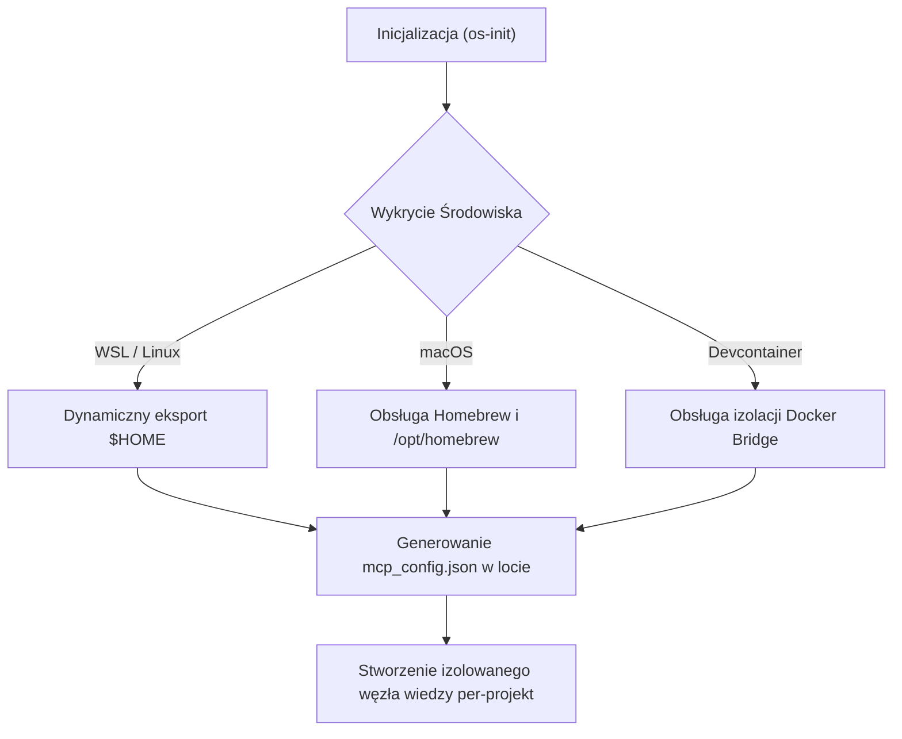
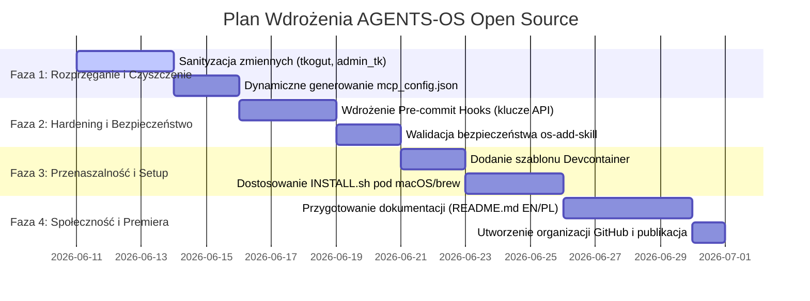

# 🛸 AGENTS-OS v5.0 Open Source Transition Plan
> **Document Status:** PROPOSAL / STRATEGIC ROADMAP  
> **Target Version:** v5.0.0-OSS  
> **Author:** Antigravity Orchestrator & Docs Architect

This document outlines the architectural changes, sanitization steps, security guardrails, and community-building blocks necessary to transform the private **AGENTS-OS v5.0** framework into a public, zero-setup open-source product for the global AI-agent developer community.

---

## 1. Podsumowanie Wykonawcze (Executive Summary)

### Cel projektu
Przekształcenie systemu operacyjnego dla agentów **AGENTS-OS** (aktualnie zoptymalizowanego pod prywatne środowisko WSL użytkownika `tkogut`) w uniwersalny, przenośny i bezpieczny produkt Open Source (dostępny na zasadach licencji **MIT** lub **Apache 2.0**).

### Grupa docelowa (Target Audience)
Deweloperzy AI, inżynierowie oprogramowania wykorzystujący CLI agentyczne (np. Claude Code, Gemini-CLI, aider) oraz zespoły pragnące zaimplementować bezpieczne pętle Swarm (triady agentyczne) z dynamicznym ładowaniem instrukcji context-aware.

---

## 2. Audyt Zależności i Wartości Zahardkodowanych (Hardcoding Audit)

Podczas audytu kodu źródłowego zidentyfikowano kluczowe punkty powiązania z prywatnym środowiskiem, które uniemożliwiają natychmiastowe upublicznienie:

| Plik | Linia | Wykryte Powiązanie (Coupling) | Wymagany Stan Docelowy (OSS) |
| :--- | :--- | :--- | :--- |
| `.gemini/mcp_config.json` | 6 | `/home/tkogut/projects/agents-os-core/...` | Ścieżka dynamiczna, np. względna `/` lub generowana podczas setupu jako `$HOME`. |
| `INSTALL.sh` | 4, 302 | `User tkogut` i opis `tkogut/nazwa-projektu` | Dynamiczne wykrywanie użytkownika GitHub (użycie `gh api user` lub git config). |
| `README.md` | 67, 428 | `git clone https://github.com/tkogut/agents-os-core.git` | Link do publicznej organizacji, np. `github.com/agents-os/core.git`. |
| `.agents/specs/AGENTS-OS.md` | 22 | `The Orchestrator (Użytkownik - tkogut)` | Uogólnienie roli do `The Orchestrator (Użytkownik / Dev)`. |

---

## 3. Strategia Rozprzęgania Architektury (Decoupling Strategy)

Aby zapewnić pełną przenaszalność systemu, należy wdrożyć następujące mechanizmy dynamiczne:

### 3.1. Dynamiczna Konfiguracja MCP
Lokalny plik `.gemini/mcp_config.json` nie może zawierać bezwzględnych ścieżek z nazwą użytkownika `tkogut`. Skrypt `os-init` zostanie zmodyfikowany tak, aby przy tworzeniu nowego projektu dynamicznie generował ten plik w oparciu o wykrytą ścieżkę roboczą (`$PROJECT_DIR`).

### 3.2. Pełne Wsparcie dla macOS & Devcontainers
*   **macOS / Homebrew:** Dostosowanie `INSTALL.sh`, aby automatycznie wykrywał instalację `brew` i instalował zależności (`gh`, `npm`, `python3`) w katalogu `/opt/homebrew` lub `/usr/local`.
*   **Devcontainer Ready:** Dodanie domyślnego katalogu `.devcontainer/` do szablonu **Vault**, co pozwoli programistom uruchamiać system wewnątrz izolowanych kontenerów bez konieczności instalowania czegokolwiek na systemie hosta.

---

## 4. Bezpieczeństwo i Zabezpieczenia Kodu (OSS Guardrails)

Publikacja frameworku wymaga wdrożenia zaawansowanych mechanizmów ochronnych:

### 4.1. Zapobieganie Wyciekom Tokenów (Secret Prevention)
*   **Git Hooks (Pre-commit hook):** Wdrożenie w pliku `hooks.json` automatycznego skanowania zmian pod kątem obecności tokenów GitHub (`gho_`, `github_pat_`) oraz kluczy API Gemini/Anthropic przed zatwierdzeniem commita.
*   **Blokada plików `.env`:** Dodanie twardego sprawdzania w `test_bootstrap.sh` czy pliki konfiguracyjne `.env` nie zostały omyłkowo włączone do indeksu Git.

### 4.2. Hardening Pobierania Skilli (`os-add-skill`)
Skrypt `os-add-skill` musi przejść audyt bezpieczeństwa w celu zabezpieczenia przed wstrzykiwaniem kodu:
*   Zablokowanie możliwości podawania niestandardowych URL bez wcześniejszego zdefiniowania listy zaufanych domen (Whitelist: `github.com/agents-os/`).
*   Wymuszenie weryfikacji sum kontrolnych (Checksum verification) dla pobieranych z zewnątrz skryptów wykonywalnych.

---

## 5. Standardy Społeczności i Model Prawny (OSS Readiness)

Projekt musi posiadać ustandaryzowane pliki społecznościowe w głównym katalogu:

1.  **[LICENSE](file:///home/tkogut/projects/agents-os-core/LICENSE) (MIT License):** Zapewnia maksymalną swobodę użycia, modyfikacji i komercjalizacji przez społeczność.
2.  **[CONTRIBUTING.md](file:///home/tkogut/projects/agents-os-core/CONTRIBUTING.md):** Przewodnik dla programistów wyjaśniający jak tworzyć i testować własne skille systemowe (Skille do `os-add-skill`).
3.  **[CODE_OF_CONDUCT.md](file:///home/tkogut/projects/agents-os-core/CODE_OF_CONDUCT.md):** Standardowy kodeks postępowania oparty na *Contributor Covenant*.
4.  **Szablony zgłoszeń (Issue Templates):** Gotowe formularze w `.github/issue_template/` dla zgłaszania błędów (Bug Report) i propozycji nowych funkcji (Feature Request).

---

## 6. Harmonogram i Krok po Kroku (OSS Roadmap)

### Faza 1: Rozprzęganie i Czyszczenie (Decoupling & Sanitization)
- Zastąpienie wszystkich zahardkodowanych wartości ścieżek Linux/Windows zmiennymi środowiskowymi.
- Oczyszczenie szablonu **Vault** tak, aby po wywołaniu `os-init` automatycznie pobierał dane użytkownika uruchamiającego proces.

### Faza 2: Zabezpieczenia (Security Hardening)
- Implementacja filtrów bezpieczeństwa na serwerach MCP, aby zapobiec odczytowi plików konfiguracyjnych systemu operacyjnego przez modele.
- Zaimplementowanie mechanizmu weryfikacji sygnatur skilli.

### Faza 3: Wieloplatformowość (Multi-platform & Dev)
- Przetestowanie instalatora na środowiskach macOS (architektura ARM/Apple Silicon).
- Stworzenie obrazu Docker/Devcontainer ze wstępnie zainstalowanym i skonfigurowanym `Antigravity CLI` i zalogowanym `gh`.

### Faza 4: Społeczność (Public Release)
- Przeniesienie repozytorium do dedykowanej organizacji na GitHubie (np. `agents-os`).
- Opublikowanie katalogu Awesome Skills pod adresem publicznym, aby każdy mógł zgłosić swój moduł przez Pull Request.

---

> [!TIP]
> Wdrożenie szablonu Devcontainer w Fazie 3 pozwoli na natychmiastowe uruchomienie roju w chmurze (np. GitHub Codespaces), co drastycznie obniży barierę wejścia dla nowych użytkowników.
