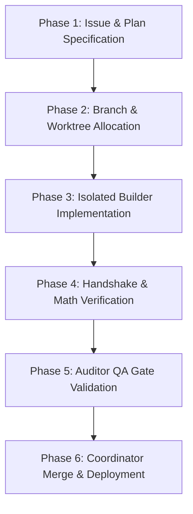

# 🔄 SDLC Lifecycle Standard (v6.5 Swarm Edition)

**Status:** Single Source of Truth for Software Development Life Cycle  
**Governance Model:** AGENTS-OS v6.5 Swarm Triad (Coordinator, Builder, Auditor)

---

## 📌 The 6-Phase Execution Pipeline

Every code change, bugfix, or feature addition in `mms4tk` strictly adheres to the following 6-phase lifecycle:

---

### Phase 1: Issue & Plan Specification
- Every task must begin with a clear goal statement or structured plan in `.agents/plans/` or tracker issue.
- The **Coordinator** assigns roles and validates architectural boundaries before execution.

### Phase 2: Branch & Worktree Allocation
- **Isolated Workspace**: Feature work is forbidden directly on `main`.
- All development takes place in a fresh Git Worktree created via `./os-run-builder <task_name>` in `tmp/worktrees/task_<name>/`.

### Phase 3: Isolated Builder Implementation
- The **Builder** role operates strictly inside the isolated worktree directory.
- Edits are limited to feature files, unit tests, and source modules.
- Under Swarm Triad rules, commits must set `SWARM_ROLE=builder`.

### Phase 4: Handshake & Math Verification
- Prior to completion, code must pass full unit test suites (`pytest`).
- Output statement:
  > "Handshake Verified: Plan-Alignment and Math-Consistency checked. Ready for Coordinator Push."

### Phase 5: Auditor QA Gate Validation
- The **Auditor** verifies that:
  1. No secret leaks or unauthenticated mutating endpoints exist.
  2. All validation gates defined in `.ai/agentic.config.json` pass (`52/52 PASSED`).
  3. Pre-commit role hooks are respected.

### Phase 6: Coordinator Merge & Deployment
- The **Coordinator** merges the worktree branch into `main` using `--no-ff`.
- The worktree is cleaned up via `git worktree remove`.
- Code is pushed to `origin/main` and deployed to VPS (`srv1490214.hstgr.cloud`).
